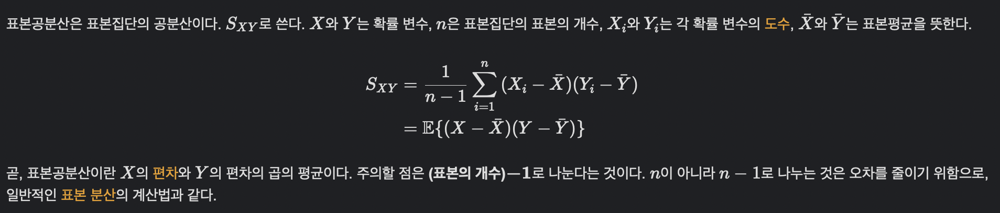
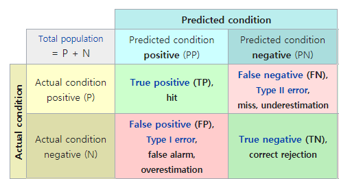
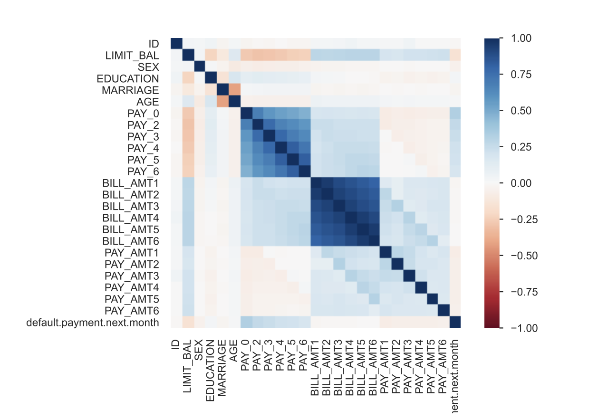
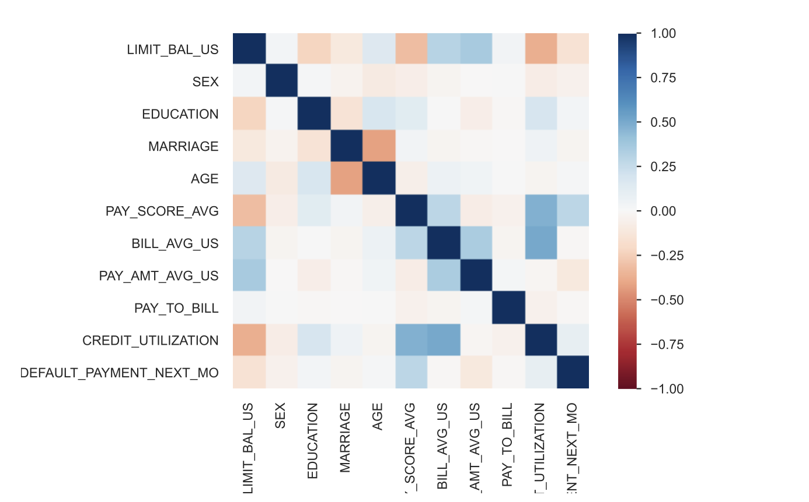
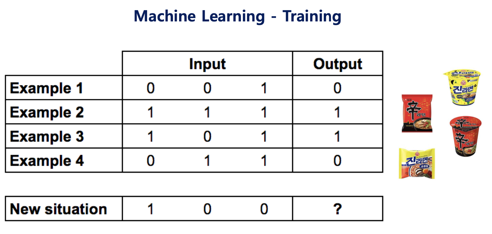
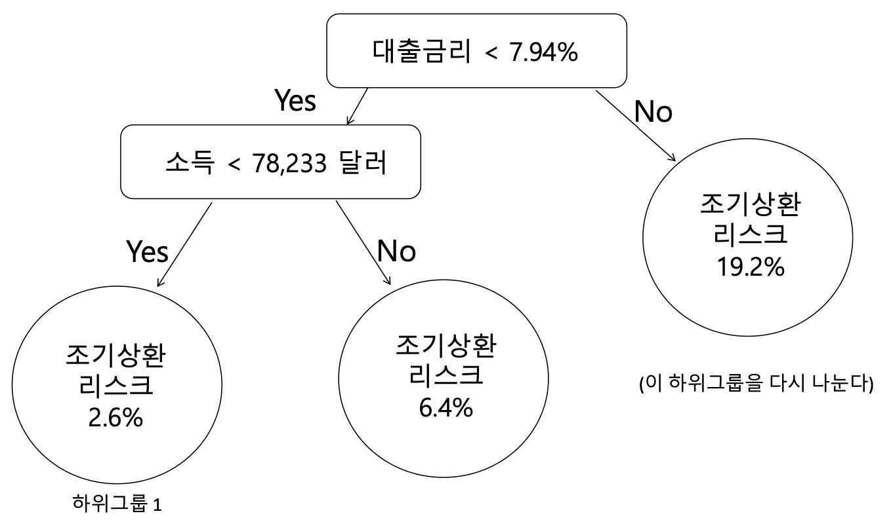
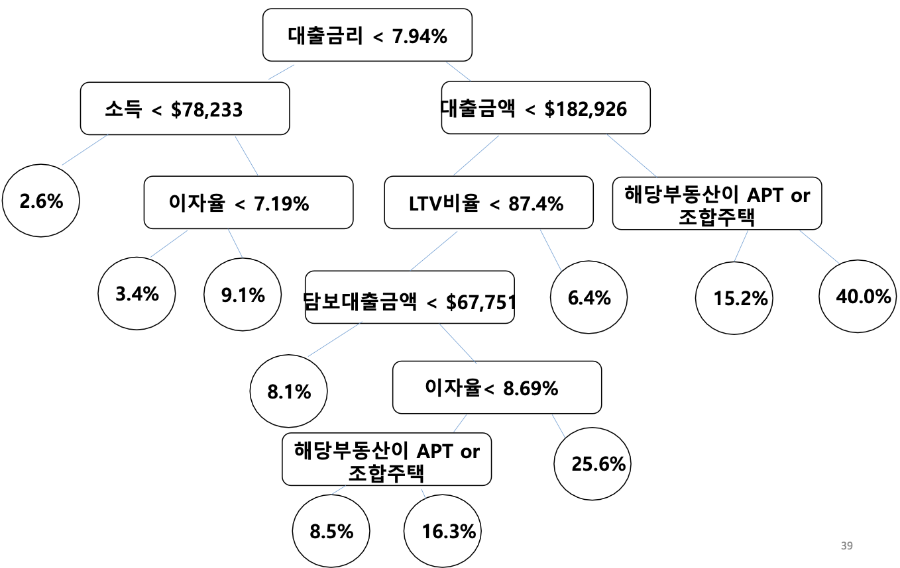
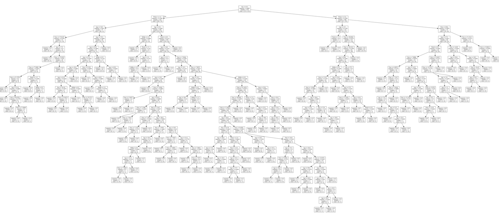

# data analysis

## 2021-06-02

NumPy의 함수
import numpy as np
np.array()
.strides
.size
np.sum()
np.mean(자료형, axis=0) : 2차원 배열 기준으로 축 0은 열 1은 행 
np.amin


프로젝트마다 하나의 가상환경을 만들어 주는 것이 일반적.

1	conda deactivate multi
2	conda create --name multi python=3.7.6
3	conda activate multi 
4	pip install ipykernel
5	python -m ipykernel install --user --name multi --display-name "Python Multi"
6	conda install -c conda-forge jupyterlab


pip install pandas-profiling==2.11.0

pip install opencv-python-headless

pip install opencv-python opencv-python-headless

pip install xgboost

pip install shap

pip install keras==2.3.1

pip install tensorflow==2.2.0

pip install lightgbm


pip install scikit-learn

pip install tqdm

pip install pandas

pip install PyYAML

pip install matplotlib

pip install seaborn

pip freeze > tmp.txt


conda install numpy pandas matplotlib

conda install -c conda-forge scikit-learn

conda install jupyter notebook

conda install jupyterlab


## 2021-06-07

### 수업 준비

conda env 중 multi

pip install pandas==1.2.3

pip install pandas-profiling==2.12.0

pip install ipywidgets


pip freeze 사용하여 현재 설치한 패키지의 목록과 버전 확인.


### 이전 수업 복기

#### numpy

자료를 다루는 틀을 제공(array).

`np.array([리스트])` 를 통해 array 생성.

```python
np.shape
np.ndim
np.strides
```


#### pandas의 데이터 프레임

`df.Series()` key와 value 형식(딕셔너리) -> Map/Reduce

과거에는 table 형식으로 데이터를 저장했으나, 최근에는 log data를 대부분 key-value 형식으로 저장하고 있음. 데이터가 매우 방대하기 때문. 앞으로는 인덱스 컬럼, 테이블보다는 이런 형식의 데이터를 다루는 법을 알아야 함.

`df.DataFrame()` index column 형식. 엑셀을 떠올리면 됨.

```python
pandas.info()
pandas.describe()
dp.profiling_report()
```


### pandas/pandas-profiling

수업의 최종 목적: 논리적인 사고 + 문제해결능력

kaggle을 활용하여 모르는 부분을 학습할 수 있음.


데이터 입력

```python
import pandas as pd
url = 'https://raw.githubusercontent.com/duc-ke/edu_jupyter_pandas/master/dataset/iris_sample.csv'
df_iris_sample = pd.read_csv(url)
df_iris_sample.tail()
df_iris_sample.info()
df_iris_sample.describe()
```

.describe() 에서는 object형태의 데이터를 확인할 수 없음


```python
import pandas_profiling
df_iris_sample.profile_report()
```


개략


꽃잎의 넓이가 numeric이 아닌 categorical 변수로 인식되어있음.


상관관계 보기

1에 가까울수록 양의 상관관계 / -1에 가까울수록 음의 상관관계

- 꽃받침이 넓을수록 꽃받침의 길이도 길다 ...


### kaggle을 이용한 pandas 학습

kaggle 접속


## 2021-06-08


### Google Colab 사용 방법

- 방향키 ↑↓: 셀 간 이동
- Enter: 편집모드
- Ctrl + Enter: 셀 실행
- Shift + Enter: 셀 실행 + 다음 셀 선택

----

- Ctrl +M D: 셀 삭제
- Ctrl + M K: 셀 위로 이동
- Ctrl + M J: 셀 아래로 이동

더블클릭 또는 Enter 키를 눌러 수정


### profiling

일반 데이터를 profiling하면 범주형 데이터들이 포함되지 않은 채로 상관관계 적용.

이를 해결하기 위해 범주형 데이터를 encoding하여 모든 변수를 포함한 correlation matrix를 볼 수 있다.


## 2021-06-09

### PCA(Principal Component Analysis)

데이터 추상화.


#### 데이터의 종류

- Numeric
  - Integer
  - Float
- Categorical
  - Nominal
  - Ordinal
  - Boolean


#### Feature Selection Method

변수에 따라 Feature Selection Method를 선택

| Variable            | Numerical Input          | Categorical Input                  |
| ------------------- | ------------------------ | ---------------------------------- |
| Numerical Output    | Pearson's(*), Spearman's | ANOVA, Kendall's                   |
| Catergorical Output | ANOVA, Kendall's         | Chi-squared(*), Mutual Information |


#### 평균(Mean) 

- M = (a1 + a2 + a3 + ... + an)/n


#### 분산(Variance)

(평균을 기준으로) 변수가 흩어진 정도. 편차 제곱(squared deviatioins)의 평균값(mean value).

- V = {(a1-m)^2 + (a2-m)^2 + (a3-m)^2 + ... + (an-m)^2}/n

  - 모분산(population variance): σ^2 => 관측값에서 모평균을 빼고 그것을 제곱한 값을 모두 더하여 전체 데이터 수 n으로 나눈 것.

  - 표본분산(sample variance):  *s*^2 => 관측값에서 표본평균을 빼고 제곱한 값을 모두 더한 것을 n−1로 나눈 것.


#### 공분산(Covariance)

두 개의 확률 변수의 선형관계를 나타내는 값. 두 개의 확률 변수의 흩어진 정도. 한 확률 변수의 증감에 따른 다른 확률 변수의 증감 경향에 대한 측도.

- Cov(X, Y) = {(X1 - XM)(Y1 - YM) + (X2 - XM)(Y2 - YM) + (X3 - XM)(Y3 - YM) + ... + (Xn - XM)(Yn - YM)}/n





#### 이진 분류 기법(binary classification)

| Predicted\Actual   | Actual Values = 1 | Actual Values =0 |
| ------------------ | ----------------- | ---------------- |
| Predicted Values=1 | True Positive     | False Positive   |
| Predicted Values=0 | False Negative    | True Negative    |



- True Positive: ~할 것이라 예측하고, 실제로 ~함.
- False Positive: ~할 것이라 예측했으나, 실제로는 ~하지 않음. - Type I error
- False Negative: ~하지 않을 것이라 예측했으나, 실제로는 ~함. - Type II error
- True Negative: ~하지 않을 것이라 예측하고, 실제로 ~하지 않음.


#### Recall과 Precision

- Recall model: False negative(Type II error)를 줄이는 데에 중점. - 공장에서 불량검사를 할 때, 양품이 불량으로 판정되어도 치명적이지 않지만, 불량을 양품으로 판정하면 치명적임. positive와 negative의 비율이 매우 불균형한 경우에 많이 사용(공장에서 생산한 물건은 대부분 양품이고, 소수의 불량품을 찾아내는 것처럼).
- Precision model: False positive(Type I error)를 줄이는 데에 중점. - 사진 분석처럼 특정 개체를 인식할 때는 엉뚱하게 인식하는 오류를 줄이는 것이 중요.


#### 피어슨 상관계수를 통한 신용카드 이용내역 분석

- 피어슨 r



PAY_AMT1~6은 유사한 변수 - 상관관계 분석 시 분산을 교란함. 이는 분석모델에 악영향. 또한 모델의 차원이 많을수록 예측값의 정확도가 낮아짐. 변수를 통합해서 활용. -> 다중공선성 제거.

즉, 차원 축소를 위한 기준으로서 feature selection


- 다중공선성 제거 이후의 피어슨 r




- 빅데이터는 표본을 추출하지 않고 모집단 채로 자료를 분석.


## 2021-06-10

### Machine Learning

#### "예측(Predict)"이란?

- 이전에 본 적 없는 새로운 데이터에 대한 정확한 출력 예측.

제시된 사진이 코끼리인지 바나나인지 판별하는 것은 predict(그 중에서도 classification).

전기 수요나 수도의 사용량, 오늘 오후의 기온 등 연속된 numerical value를 예측하는 것은 regression이라고 함.


#### Predictive Analytics

	1. 무엇을 예측하는가?
 	2. 무엇을 할 것인가?


예측을 위해서는 모델을 생성




#### 예측분석 사례 - Decision Tree

예측 분석 응용: 이탈 모델링으로 고객 이탈 방지하기

- 무엇을 예측하는가?
  - 어느 고객이 떠나갈 것인가?
- 무엇을 할 것인가?
  - 떠날 위기에 있는 고객들을 타깃으로 한 고객 유지 마케팅 수행.

---

예측 분석 응용: 부동산 담보대출 채권 가치 추산

- 무엇을 예측하는가?
  - 부동산 담보대출 고객 중에서 누가 향후 90일 내에 조기상환할 것인가?
- 무엇을 할 것인가?
  - 부동산 담보대출 채권의 가치를 계산한 후 다른 은행에 팔아넘길지 여부를 결정.


조건을 생성하여 의사결정구조 형성




엔트로피가 높은 조건부터 낮은 조건 순으로 분화




각 노드별로 세분화하여 확률을 평가




예측을 통해 위험 회피


### 머신러닝의 데이터 준비과정(Data Preparation)

#### 데이터 준비과정의 중요성

원시 데이터를 모델링에 적합한 형식으로 변환하는 작업이 중심 내용이며, 데이터를 준비하는 것은 예측 모델 생성 프로젝트에서 가장 중요한 부분이며 가장 많은 시간이 소요

- 데이터 정리 : 데이터의 오류 또는 오류를 식별하고 수정
- 특징 선택 : 작업과 가장 관련된 입력 변수 식별
- 데이터 변환 : 변수의 척도 또는 분포 파악
- 특징 엔지니어링 : 사용 가능한 데이터에서 새로운 변수 도출
- 차원 감소 : 데이터의 간결한 예측 생성


#### 결측치 처리

`dataframe.isnull().sum()` 을 통해 결측치 여부 확인.

SimpleImputer() 클래스를 사용하여 NaN 값으로 표시된 모든 누락 된 값을 열의 평균으로 변환.

```python
# statistical imputation transform for the horse colic dataset

from numpy import isnan
from pandas import read_csv
from sklearn.impute import SimpleImputer

# load dataset
url = 'https://raw.githubusercontent.com/jbrownlee/Datasets/master/horse-colic.csv'
dataframe = read_csv(url, header=None, na_values='?')

# split into input and output elements
data = dataframe.values
ix = [i for i in range(data.shape[1]) if i != 23]
X, y = data[:, ix], data[:, 23]

# print total missing
print('Missing: %d' % sum(isnan(X).flatten()))

# define imputer
imputer = SimpleImputer(strategy='mean')

# fit on the dataset
imputer.fit(X)

# transform the dataset
Xtrans = imputer.transform(X)

# print total missing
print('Missing: %d' % sum(isnan(Xtrans).flatten()))
```


#### 특징 추출

**Recursive Feature Elimination**

예측 모델을 개발할 때 입력 변수의 수를 줄이는 프로세스

RFE 사용하여 기능 추출(scikit-learn).


**Regression Feature Selection**

(Numerical input, Numerical output)


#### 데이터 정규화

- 정규화(Normalization): typically means rescales the values into a range of [0, 1].
- 표준화(Standardization): typically means rescales data to have a mean of 0 and a standard deviation of 0 (unit variance).

sklearn의 `StandardScaler()` 활용하여 표준화.


#### 원 핫 인코딩으로 범주 변환(One Hot Encoding)


#### 숫자 변수의 범주형 변수로 변환


#### PCA를 통한 차원 축소
