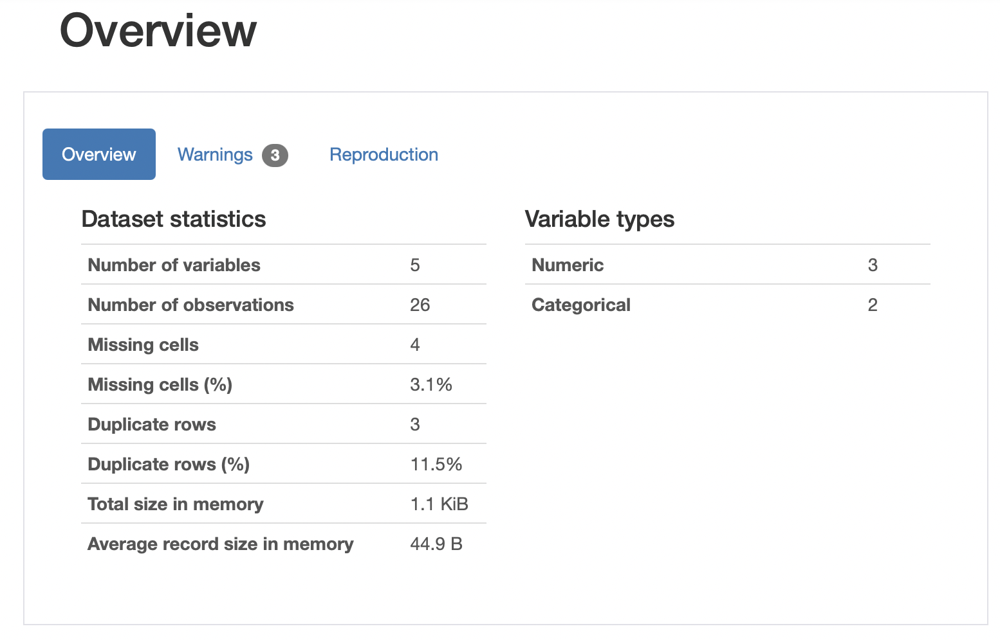
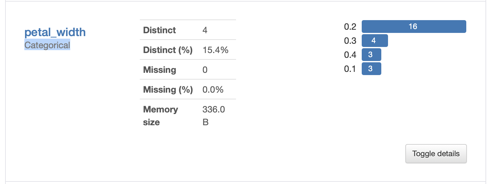
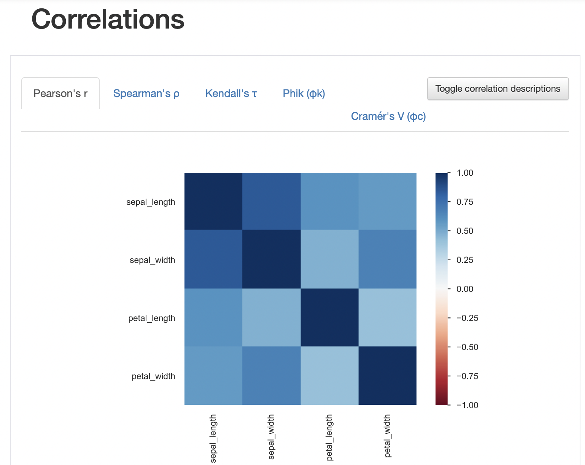

# data analysis

## 2021-06-02

NumPy의 함수
import numpy as np
np.array()
.strides
.size
np.sum()
np.mean(자료형, axis=0) : 2차원 배열 기준으로 축 0은 열 1은 행 
np.amin


프로젝트마다 하나의 가상환경을 만들어 주는 것이 일반적.

1	conda deactivate multi
2	conda create --name multi python=3.7.6
3	conda activate multi 
4	pip install ipykernel
5	python -m ipykernel install --user --name multi --display-name "Python Multi"
6	conda install -c conda-forge jupyterlab


pip install pandas-profiling==2.11.0

pip install opencv-python-headless

pip install opencv-python opencv-python-headless

pip install xgboost

pip install shap

pip install keras==2.3.1

pip install tensorflow==2.2.0

pip install lightgbm


pip install scikit-learn

pip install tqdm

pip install pandas

pip install PyYAML

pip install matplotlib

pip install seaborn

pip freeze > tmp.txt


conda install numpy pandas matplotlib

conda install -c conda-forge scikit-learn

conda install jupyter notebook

conda install jupyterlab


## 2021-06-07

### 수업 준비

conda env 중 multi

pip install pandas==1.2.3

pip install pandas-profiling==2.12.0

pip install ipywidgets


pip freeze 사용하여 현재 설치한 패키지의 목록과 버전 확인.


### 이전 수업 복기

#### numpy

자료를 다루는 틀을 제공(array).

`np.array([리스트])` 를 통해 array 생성.

```python
np.shape
np.ndim
np.strides
```


#### pandas의 데이터 프레임

`df.Series()` key와 value 형식(딕셔너리) -> Map/Reduce

과거에는 table 형식으로 데이터를 저장했으나, 최근에는 log data를 대부분 key-value 형식으로 저장하고 있음. 데이터가 매우 방대하기 때문. 앞으로는 인덱스 컬럼, 테이블보다는 이런 형식의 데이터를 다루는 법을 알아야 함.

`df.DataFrame()` index column 형식. 엑셀을 떠올리면 됨.

```python
pandas.info()
pandas.describe()
dp.profiling_report()
```


### pandas/pandas-profiling

수업의 최종 목적: 논리적인 사고 + 문제해결능력

kaggle을 활용하여 모르는 부분을 학습할 수 있음.


데이터 입력

```python
import pandas as pd
url = 'https://raw.githubusercontent.com/duc-ke/edu_jupyter_pandas/master/dataset/iris_sample.csv'
df_iris_sample = pd.read_csv(url)
df_iris_sample.tail()
df_iris_sample.info()
df_iris_sample.describe()
```

.describe() 에서는 object형태의 데이터를 확인할 수 없음


```python
import pandas_profiling
df_iris_sample.profile_report()
```



개략



꽃잎의 넓이가 numeric이 아닌 categorical 변수로 인식되어있음.




상관관계 보기

1에 가까울수록 양의 상관관계 / -1에 가까울수록 음의 상관관계

- 꽃받침이 넓을수록 꽃받침의 길이도 길다 ...


### kaggle을 이용한 pandas 학습

kaggle 접속


## 2021-06-08


### Google Colab 사용 방법

- 방향키 ↑↓: 셀 간 이동
- Enter: 편집모드
- Ctrl + Enter: 셀 실행
- Shift + Enter: 셀 실행 + 다음 셀 선택

----

- Ctrl +M D: 셀 삭제
- Ctrl + M K: 셀 위로 이동
- Ctrl + M J: 셀 아래로 이동

더블클릭 또는 Enter 키를 눌러 수정


### profiling

일반 데이터를 profiling하면 범주형 데이터들이 포함되지 않은 채로 상관관계 적용.

이를 해결하기 위해 범주형 데이터를 encoding하여 모든 변수를 포함한 correlation matrix를 볼 수 있다.
