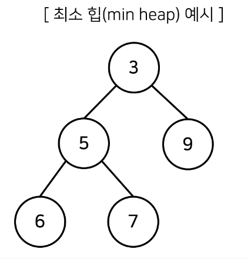
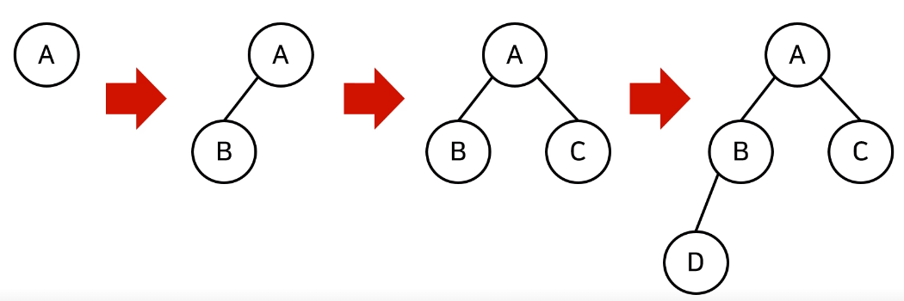
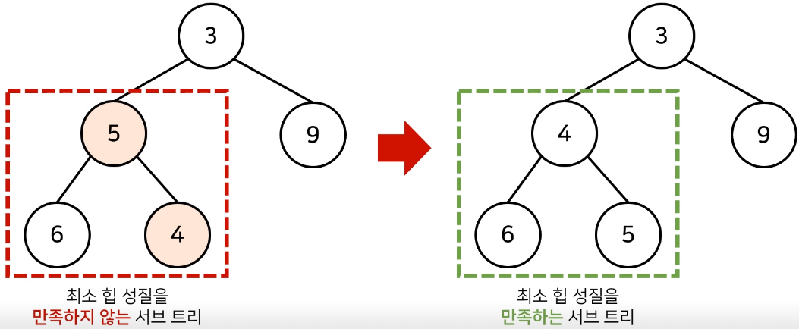
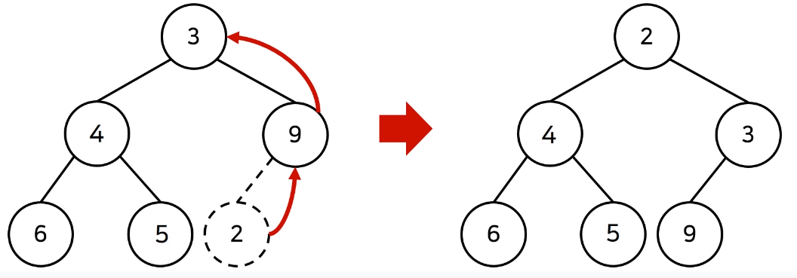
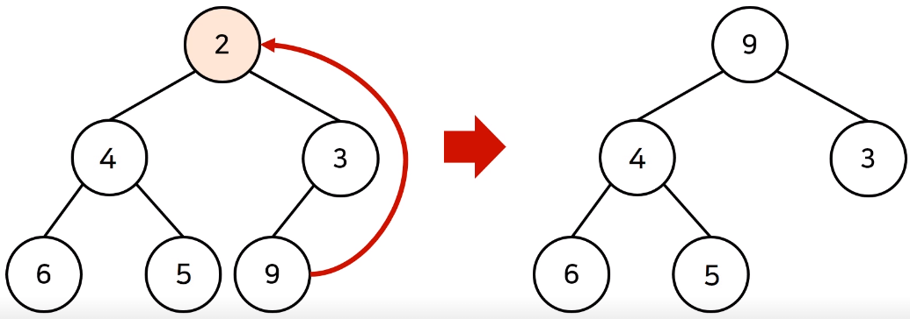
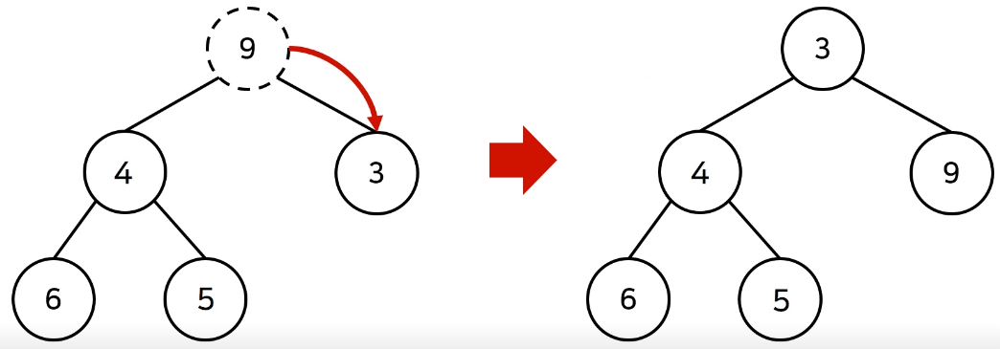
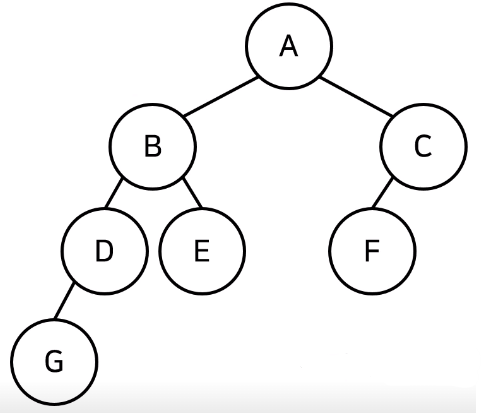
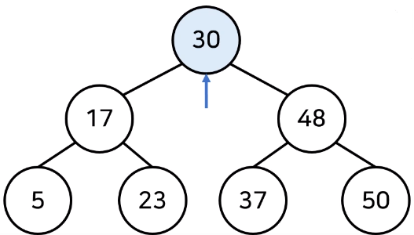
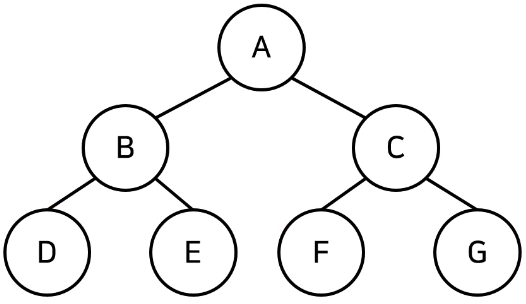

# 최적의 코딩을 결정하는 기본 알고리즘

## 1. 기본이 되는 자료구조: 스택과 큐

### 스택 자료구조

- 먼저 들어온 데이터가 나중에 나가는 형식(선입후출)의 자료구조.

- 입구와 출구가 동일한 형태로 시각화.
- "박스 쌓기"


### 스택 동작 예시

먼저 들어온 데이터가 왼쪽에 위치. 오른쪽에 삽입, 오른쪽부터 삭제.

- 5, 2, 3, 7 삽입: [5, 2, 3, 7]
- 삭제: [5, 2, 3]
- 1, 4 삽입: [5, 2, 3, 1, 4]
- 삭제: [5, 2, 3, 1]

파이썬의 리스트가 대표적.


### 스택 구현 예제

```python
stack = []

# 삽입(5) - 삽입(2) - 삽입(3) - 삽입(7) - 삭제() - 삽입(1) - 삽입(4) - 삭제()
stack.append(5)
stack.append(2)
stack.append(3)
stack.append(7)
stack.pop()
stack.append(1)
stack.append(4)
stack.pop()

print(stack[::-1]) # 최상단 원소부터 출력
print(stack) # 최하단 원소부터 출력
```

- `.append()`: 오른쪽에 원소를 삽입.
- `.pop()`: 가장 오른쪽의 원소를 추출.

*`lst[::-1]` 을 이용하면 최상단 원소부터(역순) 출력


C++는 stl 라이브러리에서 스택자료구조 지원,  Java도 마찬가지. `.push()`, `.pop()` 이용.

* Java는 `.peek()` 메서드를 이용해야 최상단 원소부터 출력 가능.


 ### 큐 자료구조

- 먼저 들어온 데이터가 먼저 나가는 형식(선입선출)의 자료구조.
- 입구와 출구가 뚫려 있는 형태로 시각화.
- "터널"


### 큐 동작 예시

먼저 들어온 데이터가 오른쪽에 위치. 왼쪽에 삽입, 오른쪽부터 삭제.

- 5, 2, 3, 7 삽입: [7, 3, 2, 5]
- 삭제: [7, 3, 2]
- 1, 4 삽입: [4, 1, 7, 3, 2]
- 삭제: [4, 1, 7, 3]


### 큐 구현 예제

```python
from collections import deque

# 큐(Queue) 구현을 위해 deque 라이브러리 사용
queue = deque()

# 삽입(5) - 삽입(2) - 삽입(3) - 삽입(7) - 삭제() - 삽입(1) - 삽입(4) - 삭제()
queue.append(5)
queue.append(2)
queue.append(3)
queue.append(7)
queue.popleft()
queue.append(1)
queue.append(4)
queue.popleft()

print(queue) # 먼저 들어온 순서대로 출력. 즉, 실제 구현하고자 하는 상황의 역순으로 정렬된 상태.
queue.reverse() # 역순으로 바꾸기
print(queue) # 나중에 들어온 원소부터 출력 - 의도한 형태 완성.
```

* 리스트를 이용해도 기능적으로는 큐 자료구조를 구현할 수 있지만, deque 라이브러리를 사용하는 것이 효율적.


C++는 stl 라이브러리에서 큐자료구조 지원, `.push()`, `.pop()` 이용. Java도 마찬가지. `.offer()`, `.poll()` 이용.


## 2. 우선순위에 따라 데이터를 꺼내는 자료구조

### 우선순위 큐(Priority Queue)

- 우선순위가 가장 높은 데이터를 가장 먼저 삭제하는 자료구조.

- 데이터를 우선순위에 따라 처리하고 싶을 때 사용.

  - 예시) 물건 데이터를 자료구조에 넣었다가 가치가 높은 물건부터 꺼내서 확인해야 하는 경우

    | 자료구조                    | 추출되는 데이터             |
    | --------------------------- | --------------------------- |
    | 스택(Stack)                 | 가장 나중에 삽입된 데이터   |
    | 큐(Queue)                   | 가장 먼저 삽입된 데이터     |
    | 우선순위 큐(Priority Queue) | 가장 우선순위가 높은 데이터 |


### 우선순위 큐의 구현

1. 리스트를 이용하여 구현

2. 힙(heap) 자료구조를 이용하여 구현

   

- 데이터의 개수가 N개일 때, 구현 방식에 따라 시간 복잡도 비교

  | 우선순위 큐 구현 방식 | 삽입 시간 | 삭제 시간 |
  | --------------------- | --------- | --------- |
  | 리스트                | O(1)      | O(N)      |
  | 힙(heap)              | O(logN)   | O(logN)   |


- 단순히 N개의 데이터를 힙에 넣었다가 모두 꺼내는 작업은 정렬과 동일(힙 정렬).
  - 이 경우 시간 복잡도는 O(NlogN)


### 힙(heap)의 특징

- 힙은 완전 이진 트리 자료구조의 일종.

- 힙에서는 항상 루트 노드(root node)를 제거.

- **최소 힙(min heap)**

  - 루트 노드가 가장 작은 값.

  - 값이 작은 데이터가 우선적으로 제거.

    

- **최대 힙(max heap)**

  - 루트 노드가 가장 큰 값.
  - 값이 큰 데이터가 우선적으로 제거.


### 완전 이진 트리(Complete Binary Tree)

- 루트(root) 노드부터 시작하여 왼쪽 자식 노드, 오른쪽 자식 노드 순서대로 데이터가 차례대로 삽입되는 트리(tree).

  


### 최소 힙 구성 함수: Min-Heapify()

- 상향식: 부모 노드로 거슬러 올라가며, 부모보다 자신의 값이 더 작은 경우에 위치를 교체.

  

- 새로운 원소가 삽입되었을 때 O(logN)의 시간 복잡도로 힙 성질을 유지할 수 있음.

  

- 힙에서 원소가 제거될 때에도 O(logN)의 시간 복잡도로 힙 성질을 유지할 수 있음.

  - 원소를 제거할 때는 가장 마지막 노드가 루트 노드의 위치에 오도록 함.

    

  - 이후 루트 노드에서 하향식으로(더 아래의 노드로) Heapify()를 진행.

    


### 힙 정렬 구현

우선순위 큐 라이브러리를 활용.

```python
import sys
import heapq
input = sys.stdin.readline

def heapsort(iterable):
  h = []
	result = []
	# 모든 원소를 차례대로 힙에 삽입
	for value in iterable:
    heapq.heappush(h, value)
	# 힙에 삽입된 모든 원소를 차례대로 꺼내어 담기
	for i in range (len(h)):
		result.append(heapq.heappop(h))
	return result
	
n = int(input())
arr = []

for i in range(n):
  arr.append(int(input()))

res = heapsort(arr)

for i in range(n):
  print(res[i])
```

- 파이썬은 기본적으로 최소 힙(min heap). - 힙 정렬은 오름차순 정렬을 수행.
- 최대 힙(max heap)으로 동작하기 위해서는 데이터 입출력시 값에 '-'를 추가.


C++ 우선순위 큐 라이브러리 사용. 기본적으로 최대 힙. 


## 3. 활용도가 높은 자료구조: 트리 자료구조

### 트리(Tree)

- 트리는 가계도와 같은 계층적인 구조를 표현할 때 사용할 수 있는 자료구조.

  


- 트리 관련 용어
  - 루트 노드(root node): 부모가 없는 최상위 노드.
    - 위 그림의 "A" 노드.
  - 단말 노드(leaf node): 자식이 없는 노드.
    - 위 그림의 "E", "F", "G" 노드.
  - 크기(size): 트리에 포함된 모든 노드의 개수.
    - 위 트리의 크기는 7.
  - 깊이(depth): 루트 노드부터의 거리.
    - "A" 노드의 깊이는 0
    - "D", "E", "F" 노드의 깊이는 2 ...
  - 높이(height): 깊이 중 최댓값.
    - 위 트리의 높이는 3. "G" 노드의 깊이와 일치.
  - 차수(degree): 각 노드의 간선(자식 방향) 개수.
    - "A", "B" 노드의 차수는 2
    - "C", "D" 노드의 차수는 1 ...
    - 기본적으로 트리의 크기가 N일때, 전체 간선의 개수는 N-1개.


### 이진 탐색 트리(Binary Search Tree)

- 이진 탐색이 동작할 수 있도록 고안된 효율적인 탐색이 가능한 자료구조의 일종.
- 이진 탐색 트리의 특징: 왼쪽 자식 노드 < 부모노드 < 오른쪽 자식 노드
  - 부모 노드보다 왼쪽 자식 노드가 작음.
  - 부모 노드보다 오른쪽 자식 노드가 큼.


- 이진 탐색 트리가 데이터를 조회하는 과정

  
  - 찾고자 하는 원소: '37'
  - [step1] 루트 노드부터 방문하여 탐색을 진행.
    - 1) 현재 노드와 찾는 원소 37을 비교(30 < 37).
    - 2) 찾는 원소가 더 크므로 오른쪽 방문.
  - [step2] 현재 노드와 값을 비교.
    - 1) 현재 노드와 찾는 원소 37을 비교(48 > 37).
    - 2) 찾는 원소가 더 작으므로 왼쪽 방문.
  - [step3] 현재 노드와 값을 비교.
    - 1) 현재 노드와 찾는 원소 37을 비교(37 = 37).
    - 2) 원소를 찾았으므로 탐색을 종료.
  - 탐색 과정을 진행하면서(자식 노드를 방문할 때마다) 탐색 범위가 점차 축소.
  - 이상적인 경우(왼쪽과 오른쪽의 노드 수가 균형을 이룰 때) logN에 비례하는 시간 소요.


### 트리의 순회(Tree Traversal)

- 트리 자료구조에 포함된 노드를 특정한 방법으로 한 번씩 방문하는 방법.
  - 트리의 정보를 시각적으로 확인할 수 있음.
  - 트리를 구현할 때 트리의 순회도 함께 구현하는 경우가 많음.
- 대표적인 트리 순회 방법
  - 전위 순회(pre-order traverse): 루트 - 왼쪽 자식 - 오른쪽 자식 순으로 방문.
  - 중위 순회(in-order traverse): 왼쪽 자식 - 루트 - 오른쪽 자식 순으로 방문.
  - 후위 순회(post-order traverse): 왼쪽 자식 - 오른쪽 자식 - 루트 순으로 방문.

- 트리 순회 예시

  |                        트리 구조 입력                        |                     구현된 트리                      |
  | :----------------------------------------------------------: | :--------------------------------------------------: |
  | 7<br />A B C<br />B D E<br />C F G<br />D None None<br />E None None<br />F None None<br />G None None |  |

  - 전위 순회: A - B - D - E - C - F - G
  - 중위 순회: D - B - E - A - F - C - G
  - 후위 순회: D - E - B - F - G - C - A


### 트리의 순회 구현

파이썬에서 트리를 구현할 때는 노드 클래스를 정의하여 자신의 데이터, 왼쪽 자식과 오른쪽 자식의 데이터를 입력.

``` python
class Node:
  def __init__(self, data, left_node, right_node):
    self.data = data
    self.left_node = left_node
    self.right_node = right_node
    
# 전위 순회(Preorder Traversal)
def pre_order(node):
  print(node.data, end=' ')
  if node.left_node != None:
    pre_order(tree[node.left_node])
  if node.right_node != None:
    pre_order(tree[node.right_node])
    
# 중위 순회(Inorder Traversal)
def in_order(node):
  if node.left_node != None:
    pre_order(tree[node.left_node])
  print(node.data, end=' ')
  if node.right_node != None:
    pre_order(tree[node.right_node])

# 후위 순회(Postorder Tarversal)
def post_order(node):
  if node.left_node != None:
    pre_order(tree[node.left_node])
  if node.right_node != None:
    pre_order(tree[node.right_node])
  print(node.data, end=' ')

n = int(input())
tree = {}

for i in range(n):
  data, left_node, right_node = input().split()
  if left_node == "None":
    left_node = None
  if right_node == "None":
    right_node = None
  tree[data] = Node(data, left_node, right_node)
  
pre_order(tree['A'])
print()
in_order(tree['A'])
print()
post_order(tree['A'])
```


## 4. 특수한 목적의 자료구조: 바이너리 인덱스 트리

### 문제상황: 데이터 업데이트가 가능한 상황에서의 구간 합(Interval Sum)

- 어떤 N개의 수가 주어져 있다. 그런데 중간에 수의 변경이 빈번히 일어나고 그 중간에 어떤 부분의 합을 구하려 한다. 만약에 1,2,3,4,5 라는 수가 있고, 3번째 수를 6으로 바꾸고 2번째부터 5번째까지 합을 구하라고 한다면 17을 출력하면 되는 것이다. 그리고 그 상태에서 다섯 번째 수를 2로 바꾸고 3번째부터 5번째까지 합을 구하라고 한다면 12가 될 것이다.

  - 데이터 개수: N(1 ≤ N ≤ 1,000,000)
  - 데이터 변경 횟수: M(1 ≤ M ≤ 10,000)
  - 구간 합 계산 횟수: K(1 ≤ K ≤ 10,000)
    - 매번 선형적으로 구간 합을 구한다면 모든 구간 합 계산을 처리하기 위해 N*K만큼의 연산이 필요. - 시간복잡도 단축을 위해 바이너리 인덱스 트리 활용.

  

### 바이너리 인덱스 트리(Binary Indexed Tree)

- 2진법 인덱스 구조를 활용해 구간 합 문제를 효과적으로 해결해 주는 자료구조.
  - 펜윅 트리(fenwick tree)라고도 함.

- 정수에 따른 2진수 표기

  | 정수 |             2진수 표기             |
  | :--: | :--------------------------------: |
  |  7   | 00000000 00000000 00000000 0000111 |
  |  -7  | 11111111 11111111 11111111 1111001 |

- 0이 아닌 마지막 비트를 찾는 방법

  - 특정한 숫자 K의 0이 아닌 마지막 비트를 찾기 위해서 K & -K를 계산.


## 5. 간단하면서 기본적인 정렬 알고리즘: 선택 정렬과 삽입 정렬


## 6. 더 빠른 정렬 알고리즘: 퀵 정렬과 계수 정렬


## 7. 정렬 알고리즘 비교 및 기초 문제 풀이


