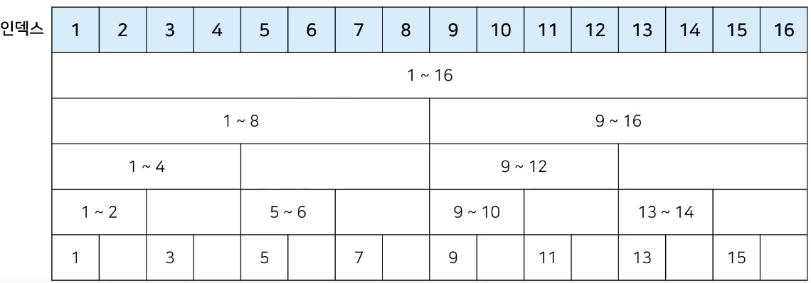
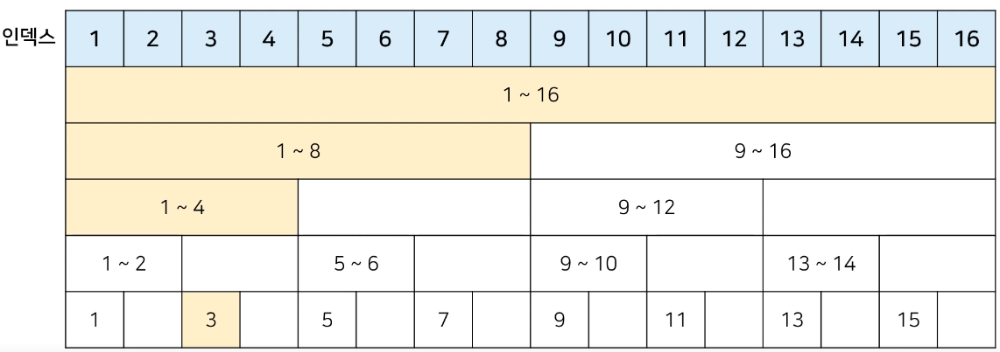
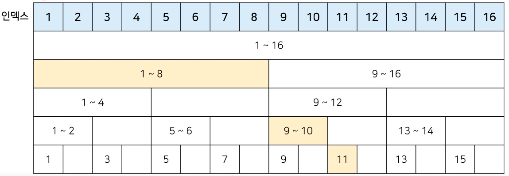
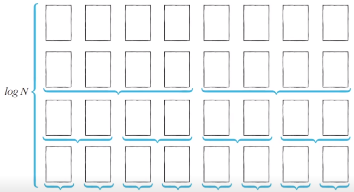
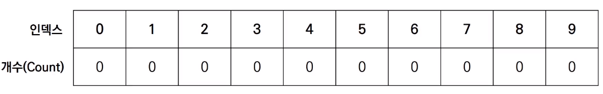
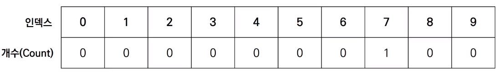
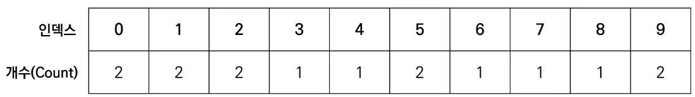

# 최적의 코딩을 결정하는 기본 알고리즘

시간복잡도의 기준: Read, Search, Insert, Delete


## 1. 기본이 되는 자료구조: 스택과 큐

### 스택 자료구조

- 먼저 들어온 데이터가 나중에 나가는 형식(선입후출)의 자료구조.

- 입구와 출구가 동일한 형태로 시각화.
- "박스 쌓기"


### 스택 동작 예시

먼저 들어온 데이터가 왼쪽에 위치. 오른쪽에 삽입, 오른쪽부터 삭제.

- 5, 2, 3, 7 삽입: [5, 2, 3, 7]
- 삭제: [5, 2, 3]
- 1, 4 삽입: [5, 2, 3, 1, 4]
- 삭제: [5, 2, 3, 1]

파이썬의 리스트가 대표적.


### 스택 구현 예제

```python
stack = []

# 삽입(5) - 삽입(2) - 삽입(3) - 삽입(7) - 삭제() - 삽입(1) - 삽입(4) - 삭제()
stack.append(5)
stack.append(2)
stack.append(3)
stack.append(7)
stack.pop()
stack.append(1)
stack.append(4)
stack.pop()

print(stack[::-1]) # 최상단 원소부터 출력
print(stack) # 최하단 원소부터 출력
```

- `.append()`: 오른쪽에 원소를 삽입.
- `.pop()`: 가장 오른쪽의 원소를 추출.

*`lst[::-1]` 을 이용하면 최상단 원소부터(역순) 출력


C++는 stl 라이브러리에서 스택자료구조 지원,  Java도 마찬가지. `.push()`, `.pop()` 이용.

* Java는 `.peek()` 메서드를 이용해야 최상단 원소부터 출력 가능.


 ### 큐 자료구조

- 먼저 들어온 데이터가 먼저 나가는 형식(선입선출)의 자료구조.
- 입구와 출구가 뚫려 있는 형태로 시각화.
- "터널"


### 큐 동작 예시

먼저 들어온 데이터가 오른쪽에 위치. 왼쪽에 삽입, 오른쪽부터 삭제.

- 5, 2, 3, 7 삽입: [7, 3, 2, 5]
- 삭제: [7, 3, 2]
- 1, 4 삽입: [4, 1, 7, 3, 2]
- 삭제: [4, 1, 7, 3]


### 큐 구현 예제

```python
from collections import deque

# 큐(Queue) 구현을 위해 deque 라이브러리 사용
queue = deque()

# 삽입(5) - 삽입(2) - 삽입(3) - 삽입(7) - 삭제() - 삽입(1) - 삽입(4) - 삭제()
queue.append(5)
queue.append(2)
queue.append(3)
queue.append(7)
queue.popleft()
queue.append(1)
queue.append(4)
queue.popleft()

print(queue) # 먼저 들어온 순서대로 출력. 즉, 실제 구현하고자 하는 상황의 역순으로 정렬된 상태.
queue.reverse() # 역순으로 바꾸기
print(queue) # 나중에 들어온 원소부터 출력 - 의도한 형태 완성.
```

* 리스트를 이용해도 기능적으로는 큐 자료구조를 구현할 수 있지만, deque 라이브러리를 사용하는 것이 효율적.


C++는 stl 라이브러리에서 큐자료구조 지원, `.push()`, `.pop()` 이용. Java도 마찬가지. `.offer()`, `.poll()` 이용.


## 2. 우선순위에 따라 데이터를 꺼내는 자료구조

### 우선순위 큐(Priority Queue)

- 우선순위가 가장 높은 데이터를 가장 먼저 삭제하는 자료구조.

- 데이터를 우선순위에 따라 처리하고 싶을 때 사용.

  - 예시) 물건 데이터를 자료구조에 넣었다가 가치가 높은 물건부터 꺼내서 확인해야 하는 경우

    | 자료구조                    | 추출되는 데이터             |
    | --------------------------- | --------------------------- |
    | 스택(Stack)                 | 가장 나중에 삽입된 데이터   |
    | 큐(Queue)                   | 가장 먼저 삽입된 데이터     |
    | 우선순위 큐(Priority Queue) | 가장 우선순위가 높은 데이터 |


### 우선순위 큐의 구현

1. 리스트를 이용하여 구현

2. 힙(heap) 자료구조를 이용하여 구현

   

- 데이터의 개수가 N개일 때, 구현 방식에 따라 시간 복잡도 비교

  | 우선순위 큐 구현 방식 | 삽입 시간 | 삭제 시간 |
  | --------------------- | --------- | --------- |
  | 리스트                | O(1)      | O(N)      |
  | 힙(heap)              | O(logN)   | O(logN)   |


- 단순히 N개의 데이터를 힙에 넣었다가 모두 꺼내는 작업은 정렬과 동일(힙 정렬).
  - 이 경우 시간 복잡도는 O(NlogN)


### 힙(heap)의 특징

- 힙은 완전 이진 트리 자료구조의 일종.

- 힙에서는 항상 루트 노드(root node)를 제거.

- **최소 힙(min heap)**

  - 루트 노드가 가장 작은 값.

  - 값이 작은 데이터가 우선적으로 제거.

    

- **최대 힙(max heap)**

  - 루트 노드가 가장 큰 값.
  - 값이 큰 데이터가 우선적으로 제거.


### 완전 이진 트리(Complete Binary Tree)

- 루트(root) 노드부터 시작하여 왼쪽 자식 노드, 오른쪽 자식 노드 순서대로 데이터가 차례대로 삽입되는 트리(tree).

  


### 최소 힙 구성 함수: Min-Heapify()

- 상향식: 부모 노드로 거슬러 올라가며, 부모보다 자신의 값이 더 작은 경우에 위치를 교체.

  

- 새로운 원소가 삽입되었을 때 O(logN)의 시간 복잡도로 힙 성질을 유지할 수 있음.

  

- 힙에서 원소가 제거될 때에도 O(logN)의 시간 복잡도로 힙 성질을 유지할 수 있음.

  - 원소를 제거할 때는 가장 마지막 노드가 루트 노드의 위치에 오도록 함.

    

  - 이후 루트 노드에서 하향식으로(더 아래의 노드로) Heapify()를 진행.

    


### 힙 정렬 구현

우선순위 큐 라이브러리를 활용.

```python
import sys
import heapq
input = sys.stdin.readline

def heapsort(iterable):
  h = []
	result = []
	# 모든 원소를 차례대로 힙에 삽입
	for value in iterable:
    heapq.heappush(h, value)
	# 힙에 삽입된 모든 원소를 차례대로 꺼내어 담기
	for i in range (len(h)):
		result.append(heapq.heappop(h))
	return result
	
n = int(input())
arr = []

for i in range(n):
  arr.append(int(input()))

res = heapsort(arr)

for i in range(n):
  print(res[i])
```

- 파이썬은 기본적으로 최소 힙(min heap). - 힙 정렬은 오름차순 정렬을 수행.
- 최대 힙(max heap)으로 동작하기 위해서는 데이터 입출력시 값에 '-'를 추가.


C++ 우선순위 큐 라이브러리 사용. 기본적으로 최대 힙. 


## 3. 활용도가 높은 자료구조: 트리 자료구조

### 트리(Tree)

- 트리는 가계도와 같은 계층적인 구조를 표현할 때 사용할 수 있는 자료구조.

  


- 트리 관련 용어
  - 루트 노드(root node): 부모가 없는 최상위 노드.
    - 위 그림의 "A" 노드.
  - 단말 노드(leaf node): 자식이 없는 노드.
    - 위 그림의 "E", "F", "G" 노드.
  - 크기(size): 트리에 포함된 모든 노드의 개수.
    - 위 트리의 크기는 7.
  - 깊이(depth): 루트 노드부터의 거리.
    - "A" 노드의 깊이는 0
    - "D", "E", "F" 노드의 깊이는 2 ...
  - 높이(height): 깊이 중 최댓값.
    - 위 트리의 높이는 3. "G" 노드의 깊이와 일치.
  - 차수(degree): 각 노드의 간선(자식 방향) 개수.
    - "A", "B" 노드의 차수는 2
    - "C", "D" 노드의 차수는 1 ...
    - 기본적으로 트리의 크기가 N일때, 전체 간선의 개수는 N-1개.


### 이진 탐색 트리(Binary Search Tree)

- 이진 탐색이 동작할 수 있도록 고안된 효율적인 탐색이 가능한 자료구조의 일종.
- 이진 탐색 트리의 특징: 왼쪽 자식 노드 < 부모노드 < 오른쪽 자식 노드
  - 부모 노드보다 왼쪽 자식 노드가 작음.
  - 부모 노드보다 오른쪽 자식 노드가 큼.


- 이진 탐색 트리가 데이터를 조회하는 과정

  
  - 찾고자 하는 원소: '37'
  - [step1] 루트 노드부터 방문하여 탐색을 진행.
    - 1) 현재 노드와 찾는 원소 37을 비교(30 < 37).
    - 2) 찾는 원소가 더 크므로 오른쪽 방문.
  - [step2] 현재 노드와 값을 비교.
    - 1) 현재 노드와 찾는 원소 37을 비교(48 > 37).
    - 2) 찾는 원소가 더 작으므로 왼쪽 방문.
  - [step3] 현재 노드와 값을 비교.
    - 1) 현재 노드와 찾는 원소 37을 비교(37 = 37).
    - 2) 원소를 찾았으므로 탐색을 종료.
  - 탐색 과정을 진행하면서(자식 노드를 방문할 때마다) 탐색 범위가 점차 축소.
  - 이상적인 경우(왼쪽과 오른쪽의 노드 수가 균형을 이룰 때) logN에 비례하는 시간 소요.


### 트리의 순회(Tree Traversal)

- 트리 자료구조에 포함된 노드를 특정한 방법으로 한 번씩 방문하는 방법.
  - 트리의 정보를 시각적으로 확인할 수 있음.
  - 트리를 구현할 때 트리의 순회도 함께 구현하는 경우가 많음.
- 대표적인 트리 순회 방법
  - 전위 순회(pre-order traverse): 루트 - 왼쪽 자식 - 오른쪽 자식 순으로 방문.
  - 중위 순회(in-order traverse): 왼쪽 자식 - 루트 - 오른쪽 자식 순으로 방문.
  - 후위 순회(post-order traverse): 왼쪽 자식 - 오른쪽 자식 - 루트 순으로 방문.

- 트리 순회 예시

  |                        트리 구조 입력                        |                     구현된 트리                      |
  | :----------------------------------------------------------: | :--------------------------------------------------: |
  | 7<br />A B C<br />B D E<br />C F G<br />D None None<br />E None None<br />F None None<br />G None None |  |

  - 전위 순회: A - B - D - E - C - F - G
  - 중위 순회: D - B - E - A - F - C - G
  - 후위 순회: D - E - B - F - G - C - A


### 트리의 순회 구현

파이썬에서 트리를 구현할 때는 노드 클래스를 정의하여 자신의 데이터, 왼쪽 자식과 오른쪽 자식의 데이터를 입력.

``` python
class Node:
  def __init__(self, data, left_node, right_node):
    self.data = data
    self.left_node = left_node
    self.right_node = right_node
    
# 전위 순회(Preorder Traversal)
def pre_order(node):
  print(node.data, end=' ')
  if node.left_node != None:
    pre_order(tree[node.left_node])
  if node.right_node != None:
    pre_order(tree[node.right_node])
    
# 중위 순회(Inorder Traversal)
def in_order(node):
  if node.left_node != None:
    pre_order(tree[node.left_node])
  print(node.data, end=' ')
  if node.right_node != None:
    pre_order(tree[node.right_node])

# 후위 순회(Postorder Tarversal)
def post_order(node):
  if node.left_node != None:
    pre_order(tree[node.left_node])
  if node.right_node != None:
    pre_order(tree[node.right_node])
  print(node.data, end=' ')

n = int(input())
tree = {}

for i in range(n):
  data, left_node, right_node = input().split()
  if left_node == "None":
    left_node = None
  if right_node == "None":
    right_node = None
  tree[data] = Node(data, left_node, right_node)
  
pre_order(tree['A'])
print()
in_order(tree['A'])
print()
post_order(tree['A'])
```


## 4. 특수한 목적의 자료구조: 바이너리 인덱스 트리

### 문제상황: 데이터 업데이트가 가능한 상황에서의 구간 합(Interval Sum)

- 어떤 N개의 수가 주어져 있다. 그런데 중간에 수의 변경이 빈번히 일어나고 그 중간에 어떤 부분의 합을 구하려 한다. 만약에 1,2,3,4,5 라는 수가 있고, 3번째 수를 6으로 바꾸고 2번째부터 5번째까지 합을 구하라고 한다면 17을 출력하면 되는 것이다. 그리고 그 상태에서 다섯 번째 수를 2로 바꾸고 3번째부터 5번째까지 합을 구하라고 한다면 12가 될 것이다.

  - 데이터 개수: N(1 ≤ N ≤ 1,000,000)
  - 데이터 변경 횟수: M(1 ≤ M ≤ 10,000)
  - 구간 합 계산 횟수: K(1 ≤ K ≤ 10,000)
    - 매번 선형적으로 구간 합을 구한다면 모든 구간 합 계산을 처리하기 위해 N*K만큼의 연산이 필요. - 시간복잡도 단축을 위해 바이너리 인덱스 트리 활용.

  

### 바이너리 인덱스 트리(Binary Indexed Tree)

- 2진법 인덱스 구조를 활용해 구간 합 문제를 효과적으로 해결해 주는 자료구조.
  - 펜윅 트리(fenwick tree)라고도 함.

- 정수에 따른 2진수 표기

  | 정수 |             2진수 표기             |
  | :--: | :--------------------------------: |
  |  7   | 00000000 00000000 00000000 0000111 |
  |  -7  | 11111111 11111111 11111111 1111001 |

- 0이 아닌 마지막 비트를 찾는 방법

  - 특정한 숫자 K의 0이 아닌 마지막 비트를 찾기 위해서 K & -K를 계산.

  - K & -K 계산 결과 예시

    | 정수 K |       2진수 표기       | K & -K |
    | :----: | :--------------------: | :----: |
    |   0    | 00000000 .... 00000000 |   0    |
    |   1    | 00000000 .... 00000001 |   1    |
    |   2    | 00000000 .... 00000010 |   2    |
    |   3    | 00000000 .... 00000011 |   1    |
    |   4    | 00000000 .... 00000100 |   4    |
    |   5    | 00000000 .... 00000101 |   1    |
    |   6    | 00000000 .... 00000110 |   2    |
    |   7    | 00000000 .... 00000111 |   1    |
    |   8    | 00000000 .... 00001000 |   8    |

    ```python
    n = 8
    
    for i in range(n + 1):
      print(i, "의 마지막 비트: ", (i & -i))
    ```

    | <실행 결과>                                                  |
    | ------------------------------------------------------------ |
    | 0의 마지막 비트: 0<br />1의 마지막 비트: 1<br />2의 마지막 비트: 2<br />3의 마지막 비트: 1<br />4의 마지막 비트: 4<br />5의 마지막 비트: 1<br />6의 마지막 비트: 2<br />7의 마지막 비트: 1<br />8의 마지막 비트: 8 |

    

- 트리 구조 만들기

  - 0이 아닌 마지막 비트 = 내가 저장하고 있는 값들의 개수

    

    

- 업데이트(Update)

  - 특정 값을 변경할 때: 0이 아닌 마지막 비트만큼 더하면서 구간들의 값을 변경(예시 = 3rd)

    

  - O(logN)의 시간복잡도 보장.


- 누적 합(Prefix Sum)

  - 1부터 N까지의 합(누적 합): 0이 아닌 마지막 비트만큼 빼면서 구간들의 값의 합 계산(예시 = 11th)

    

  - O(logN)의 시간복잡도 보장.


### 바이너리 인덱스 트리 구현

```python
import sys
input = sys.stdin.readline

# 데이터의 개수(n), 변경 횟수(m), 구간 합 계산 횟수(k)
n, m, k = map(int, input().split())

# 전체 데이터의 개수는 최대 1,000,000개
arr = [0] * (n + 1)
tree = [0] * (n + 1)

# i번째 수까지의 누적 합을 계산하는 함수
def prefix_sum(i):
  result = 0
  while i > 0:
    result += tree[i]
    # 0이 아닌 마지막 비트만큼 빼가면서 이동
    i -= (i & -i)
  return result 

# i번째 수를 dif만큼 더하는 함수
def update(i, dif):
  while i <= n:
    tree[i] += dif
    i += (i & -i)
    
# start부터 end까지의 구간 합을 계산하는 함수
def interval_sum(start, end):
  return prefix_sum(end) - prefix_sum(start - 1)

for i in range(1, n + 1):
  x = int(input())
  arr[i] = x
  update(i, x)
  
for i in range(m + k):
  a, b, c = map(int, input().split())
  # 업데이트(update) 연산인 경우
  if a == 1:
    update(b, c - arr[b]) # 바뀐 크기(dif)만큼 적용
    arr[b] = c
  # 구간 합(interval sum) 연산인 경우
  else:
    print(interval_sum(b, c))
```


## 5. 간단하면서 기본적인 정렬 알고리즘: 선택 정렬과 삽입 정렬

### 정렬 알고리즘

- 정렬(Sorting): 데이터를 특정한 기준에 따라 순서대로 나열하는 것.

- 일반적으로 문제 상황에 따라서 적절한 정렬 알고리즘이 공식처럼 사용됨.

  - 여러 개의 데이터를 어떻게 정렬하는가?

    예) [7, 5, 9, 0, 3, 1, 6, 2, 4, 8]


### 선택 정렬

처리되지 않은 데이터 중 가장 작은 데이터를 선택해 맨 앞에 있는 데이터와 바꾸는 것을 반복.

- 선택 정렬 동작 예시(오름차순)

  [7, 5, 9, 0, 3, 1, 6, 2, 4, 8]

  0. 처리되지 않은 데이터 중 가장 작은 '0'을 선택해 가장 앞의 '7'과 교환. 

     [0, 5, 9, 7, 3, 1, 6, 2, 4, 8]

  1. 처리되지 않은 데이터 중 가장 작은 '1'을 선택해 가장 앞의 '5'와 교환. 

     [0, 1, 9, 7, 3, 5, 6, 2, 4, 8]

  2. 처리되지 않은 데이터 중 가장 작은 '2'를 선택해 가장 앞의 '9'와 교환. 

     [0, 1, 2, 7, 3, 5, 6, 9, 4, 8]

  3. 처리되지 않은 데이터 중 가장 작은 '3'을 선택해 가장 앞의 '7'과 교환. 

     [0, 1, 2, 3, 7, 5, 6, 9, 4, 8]

  ... 이러한 과정을 반복하여 정렬 완료.

  ​	   [0, 1, 2, 3, 4, 5, 6, 7, 8, 9] : 이때, 가장 마지막에 위치한 데이터는 처리되지 않은 데이터이지만 교환할 데이터가 없으므로 의미가 없음.


### 선택 정렬 구현

선택 정렬은 동작을 반복할 때마다 탐색 범위가 줄어들고, 매번 가장 작은 원소를 찾기 위해 탐색 범위만큼의 데이터를 확인(선형 탐색)하므로, 이중 반복문을 이용하여 구현.

```python
array = [7, 5, 9, 0, 3, 1, 6, 2, 4, 8]

for i in range(len(array)):
  min_index = i # 가장 작은 원소의 인덱스
  for j in range(i + 1, len(array)):
    if array[min_index] > array[j]:
      min_index = j
  array[i], array[min_index] = array[min_index], array[i] # 스와프

print(array)
```

| <실행 결과>                    |
| :----------------------------- |
| [0, 1, 2, 3, 4, 5, 6, 7, 8, 9] |


### 선택 정렬의 시간 복잡도

- 선택 정렬은 N번 만큼 가장 작은 수를 찾아서 맨 앞으로 보내야 함.
- 구현 방식에 따라 사소한 오차는 있을 수 있으나 전체 연산 횟수는 다음과 같음.
  - N + (N -1) + (N - 2) + ... + 2
- 이는 (N^2 + N - 2) / 2 로 표현할 수 있는데, 빅오 표기법에 따라서 O(N^2)라고 작성.


### 삽입 정렬

처리되지 않은 데이터를 하나씩 골라 적절한 위치에 삽입. 

- 선택 정렬에 비해 구현 난이도가 높은 편이지만, 일반적으로 더 효율적으로 동작함.

- 삽입 정렬 동작 예시(오름차순)

  [7, 5, 9, 0, 3, 1, 6, 2, 4, 8]

  0. 첫 번째 데이터 '7'은 그 자체로 정렬이 되어 있다고 판단하고, 두 번째 데이터인 '5'가 어떤 위치로 들어갈지 판단. - '7'의 왼쪽으로 들어가거나 오른쪽으로 들어가거나 두 경우만 존재.

     [5, 7, 9, 0, 3, 1, 6, 2, 4, 8] : '5'가 '7'보다 값이 작으므로 7'의 왼쪽에 위치(교환).

  1. 다음 데이터인 '9'가 어떤 위치로 들어갈지 판단.

     [5, 7, 9, 0, 3, 1, 6, 2, 4, 8] : '9'는 '7'보다 값이 크므로 '7'의 오른쪽에 위치(유지).

  2. 다음 데이터인 '0'가 어떤 위치로 들어갈지 판단.

     [0, 5, 7, 9, 3, 1, 6, 2, 4, 8] : '0'은 '5'보다 값이 작으므로 '5'의 왼쪽에 위치. - 이때, '0'은 '9', '7', '5'와 각각 값을 비교하고 하나씩 순차적으로 위치를 바꿈.

  3. 다음 데이터인 '3'이 어떤 위치로 들어갈지 판단.

     [0, 3, 5, 7, 9, 1, 6, 2, 4, 8] : '3'은 '0'보다 크고 '5'보다 작으므로 '0'과 '5'의 사이에 위치(교환). - 마찬가지로 매번 각각의 데이터와 값을 비교하여 하나씩 위치를 바꿈.

  ... 이러한 과정을 반복하여 정렬 완료.

  ​	   [0, 1, 2, 3, 4, 5, 6, 7, 8, 9]


### 삽입 정렬 구현

선택 정렬과 마찬가지로 이중 반복문 이용.

```python
array = [7, 5, 9, 0, 3, 1, 6, 2, 4, 8]

for i in range(1, len(array)): # 두 번째 원소부터 정렬
  for j in range(i, 0, -1): # 인덱스 i부터 1까지 1씩 감소하며 반복
    if array[j] < array[j - 1]: # 한 칸씩 왼쪽으로 이동
      array[j], array[j - 1] = array[j - 1], array[j]
    else: # 자기보다 작은 데이터를 만나면 그 위치에서 멈춤
      break
      
print(array)
```

| <실행 결과>                    |
| :----------------------------- |
| [0, 1, 2, 3, 4, 5, 6, 7, 8, 9] |


### 삽입 정렬의 시간 복잡도

- 삽입 정렬의 시간 복잡도는 O(N^2).
- 삽입 정렬은 현재 리스트의 데이터가 거의 정렬되어 있는 상태라면 매우 빠르게 동작.
  - 최선의 경우 O(N)의 시간 복잡도를 가짐.
  - 이미 정렬되어 있는 상태에서 다시 삽입 정렬을 수행하면, 각 원소가 들어갈 위치를 찾기 위한 선형 탐색 과정이 수행 즉시 완료되기 때문(상수시간 소요).


## 6. 더 빠른 정렬 알고리즘: 퀵 정렬과 계수 정렬

### 퀵 정렬

기준 데이터를 설정하고 그 기준보다 큰 데이터와 작은 데이터의 위치를 바꾸는 방법.

- 일반적인 상황에서 가장 많이 사용되는 정렬 알고리즘 중 하나.

- 병합 정렬과 더불어 프로그래밍 언어의 정렬 라이브러리의 근간 알고리즘.

- 가장 기본적인 퀵 정렬은 첫 번째 데이터를 기준 데이터(Pivot)로 설정.

- 퀵 정렬 동작 예시(오름차순)

  [5, 7, 9, 0, 3, 1, 6, 2, 4, 8]

  0. 현재 피벗(첫 번째 원소)의 값은 '5'. 왼쪽부터 '5'보다 큰 데이터인 '7'을 선택, 오른쪽부터 '5'보다 작은 데이터인 '4'를 선택한 후, 두 데이터의 위치를 서로 변경.

     [5, 4, 9, 0, 3, 1, 6, 2, 7, 8]

  1. 현재 피벗의 값인 '5'가 기준이 되어 왼쪽에서는 '5'보다 큰 '9', 오른쪽에서는 '5'보다 작은 '2'를 선택한 후, 두 데이터의 위치를 서로 변경.

     [5, 4, 2, 0, 3, 1, 6, 9, 7, 8]

  2. 현재 피벗의 값 '5'를 기준으로 왼쪽에서 '5'보다 큰 '6', 오른쪽에서 '5'보다 작은 '1'을 선택. 이때, 서로의 위치가 엇갈리므로 '피벗(5)'과 '작은 데이터(1)'의 위치를 서로 변경.

     [1, 4, 2, 0, 3, **5**, 6, 9, 7, 8]

  - 분할 완료: '5(피벗)'의 왼쪽에 있는 데이터는 모두 '5'보다 작고, 오른쪽에 있는 데이터는 모두 '5'보다 큼.

    - 분할(Divide): 피벗을 기준으로 데이터 묶음을 나누는 작업(=파티션).

  - 피벗으로 분할된 데이터 묶음을 하나의 배열로 판단하여 다시 정렬 수행.

  - 왼쪽 데이터 묶음 정렬: '1'을 피벗으로 하여 정렬 수행.

    [1, 4, 2, 0, 3]

  - 오른쪽 데이터 묶음 정렬: '6'을 피벗으로 하여 정렬 수행.

    [6, 9, 7, 8]

  ... 이러한 과정을 반복하여 정렬 완료.

  ​	   [0, 1, 2, 3, 4, 5, 6, 7, 8, 9] : 퀵 정렬은 재귀적으로 정렬을 수행. 수행할 때마다 정렬하는 범위가 점차 줄어드는 형태를 가짐.


### 퀵 정렬의 시간 복잡도

퀵 정렬이 빠른 이유

- (이상적인 경우) 분할이 절반씩 일어난다면 전체 연산 횟수로 O(NlogN)의 시간 복잡도를 기대할 수 있음.

  - 너비 * 높이 = N * logN = NlogN

  


- 퀵 정렬은 평균적으로 O(NlogN)의 시간 복잡도를 가짐.
- 최악의 경우 O(N^2)의 시간 복잡도를 가짐.
  - 한쪽 방향으로 편향된 분할이 발생하면 시간 복잡도 증가.
  - 첫 번째 원소를 피벗으로 삼을 때, 이미 정렬된 배열에 대해서 퀵 정렬을 수행하는 경우 등.


### 퀵 정렬 구현

일반적인 방식

```python
array = [5, 7, 9, 0, 3, 1, 6, 2, 4, 8]

def quick_sort(array, start, end):
  if start >= end: # 원소가 1개인 경우 종료
    return
  pivot = start
  left = start + 1
  right = end
  while(left <= right):
    # 피벗보다 큰 데이터를 찾을 때까지 반복
    while(left <= end and array[left] <= array[pivot]):
      left += 1
    # 피벗보다 작은 데이터를 찾을 때까지 반복
    while(right > start and array[right] >= array[pivot]):
      right -= 1
    if(left > right): # 엇갈렸다면 작은 데이터와 피벗을 교체
      array[right], array[pivot] = array[pivot], array[right]
    else: # 엇갈리지 않았다면 작은 데이터와 큰 데이터를 교체
      array[left], array[right] = array[right], array[left]
  # 분할 이후 왼쪽 부분과 오른쪽 부분에서 각각 정렬 수행
  quick_sort(array, start, right - 1)
  quick_sort(array, right + 1, end)
  
quick_sort(array, 0, len(array) - 1)
pritn(array)
```

| <실행 결과>                    |
| :----------------------------- |
| [0, 1, 2, 3, 4, 5, 6, 7, 8, 9] |


파이썬의 장점을 살린 방식

```python
array = [5, 7, 9, 0, 3, 1, 6, 2, 4, 8]

def quick_sort(array):
  # 리스트가 하나 이하의 원소를 담고 있다면 종료
  if len(array) <= 1:
    return array
  pivot = array[0] # 피벗은 첫 번째 원소
  tail = array[1:] # 피벗을 제외한 리스트
  
  left_side = [x for x in tail if x <= pivot] # 분할된 왼쪽 부분
  right_side = [x for x in tail if x > pivot] # 분할된 오른쪽 부분
  
  # 분할 이후 왼쪽 부분과 오른쪽 부분에서 각각 정렬 수행하고, 전체 리스트 반환
  return quick_sort(left_side) + [pivot] + quick_sort(right_side)

pritn(quick_sort(array))
```

| <실행 결과>                    |
| :----------------------------- |
| [0, 1, 2, 3, 4, 5, 6, 7, 8, 9] |


### 계수 정렬

각각의 데이터가 몇 번씩 등장하는지를 세는 방식으로 동작하는 정렬 알고리즘.

- 특정한 조건에 부합할 때만 사용할 수 있지만 매우 빠르게 동작.

- 계수 정렬은 데이터의 크기 범위가 제한되어 정수 형태로 표현할 수 있을 때 사용 가능.

- 데이터의 개수가 N, 데이터(양수) 중 최댓값이 K일 때, 최악의 경우에도 시간 복잡도 O(N + K)를 보장.

- 단, 공간 복잡도는 상대적으로 높은 편.

- 계수 정렬 동작 예시(오름차순)

  7 5 9 0 3 1 6 2 9 1 4 8 0 5 2

  0. 가장 작은 데이터부터 가장 큰 데이터까지의 범위가 모두 담길 수 있도록 빈 리스트를 생성.

     

     - 각각의 인덱스는 데이터의 값을 표현
     - count는 각각의 인덱스에 해당하는 데이터의 개수를 표시.

  1. 데이터를 하나씩 확인하며 데이터 값과 동일한 인덱스의 데이터(count)를 1씩 증가시킴.

     **7** 5 9 0 3 1 6 2 9 1 4 8 0 5 2

     

  ... 이러한 과정을 반복.

  2. 최종 리스트에는 각 데이터가 몇 번씩 등장했는지 그 횟수가 기록.

     

  - 결과를 확인할 때는 리스트의 첫 번째 데이터부터 하나씩 그 값만큼 반복하여 인덱스를 출력.
    - 출력 결과: 0 0 1 1 2 2 3 4 5 5 6 7 8 9 9(정렬 완료)


### 계수 정렬 구현

```python
# 모든 원소의 값이 0보다 크거나 같다고 가정
array = [7, 5, 9, 0, 3, 1, 6, 2, 9, 1, 4, 8, 0, 5, 2]
# 모든 범위를 포함하는 리스트 선언(모든 값은 0으로 초기화)
count = [0] * (max(array) + 1)

for i in range(len(array)):
  count[array[i]] += 1 # 각 데이터에 해당하는 인덱스의 값 증가
  
for i in range(len(count)): # 리스트에 기록된 정렬 정보 확인
  for j in range(count[i]):
    print(i, end=' ') # 띄어쓰기를 구분으로 등장한 횟수만큼 인덱스 출력
```

| <실행 결과>                   |
| :---------------------------- |
| 0 0 1 1 2 2 3 4 5 5 6 7 8 9 9 |


### 계수 정렬의 시간 복잡도

- 계수 정렬의 시간 복잡도와 공간 복잡도는 모두 O(N + K).
- 계수 정렬은 때에 따라서 심각한 비효율성을 초래(데이터의 범위가 너무 큰 경우).
  - 데이터가 0과 999,999 단 2개만 존재한다면, 2개의 데이터를 위해 1,000,000개의 원소가 담길 수 있는 배열을 만들어야 함.
- 계수 정렬은 동일한 값을 가지는 데이터가 여러 개 등장할 때 효과적.
  - 성적 처리의 경우 범위가 좁고, 동점이 여러 명일 수 있기 때문에 계수 정렬이 효과적.


## 7. 정렬 알고리즘 비교 및 기초 문제 풀이

### 정렬 알고리즘 비교

| 정렬 알고리즘 | 평균 시간 복잡도 | 공간 복잡도 | 특징                                                         |
| :-----------: | :--------------: | :---------: | ------------------------------------------------------------ |
|   선택 정렬   |      O(N^2)      |    O(N)     | 아이디어가 매우 간단.                                        |
|   삽입 정렬   |      O(N^2)      |    O(N)     | 데이터가 거의 정렬되어 있을 때 가장 빠름.                    |
|    퀵 정렬    |     O(NlogN)     |    O(N)     | 대부분의 경우에 가장 적합하며, 충분히 빠름.                  |
|   계수 정렬   |     O(N + K)     |  O(N + K)   | 데이터의 크기가 한정되어 있는 경우에만 사용 가능하지만 매우 빠르게 동작. |

- 대부분의 프로그래밍 언어에서 지원하는 표준 정렬 라이브러리는 최악의 경우에도 시간 복잡도 O(NlogN)을 보장하도록 설계되어 있음.


### 선택 정렬과 기본 정렬 라이브러리 수행 시간 비교

```python
from random import randint
import time

# 배열에 10,000개의 정수를 삽입
array = []
for _ in range(10000):
  # 1부터 100 사이의 랜덤한 정수
  array.append(randint(1, 100))
  
# 선택 정렬 프로그램 성능 측정
start_time = time.time()

# 선택 정렬 프로그램 소스코드
for i in range(len(array)):
  min_index = i # 가장 작은 원소의 인덱스
  for j in range(i + 1, len(array)):
    if array[min_index] > array[j]:
      min_index = j
  array[i], array[min_index] = array[min_index], array[i]

# 측정 종료
end_time = time.time()
# 수행 시간 출력
print("선택 정렬 성능 측정: ", end_time - start_time)

# 배열을 다시 무작위 데이터로 초기화
array = []
for _ in range(10000):
  # 1부터 100 사이의 랜덤한 정수
  array.append(randint(1, 100))
  
# 기본 정렬 라이브러리 성능 측정
start_time = time.time()

# 기본 정렬 라이브러리 사용
array.sort()

# 측정 종료
end_time = time.time()
# 수행 시간 출력
print("기본 정렬 라이브러리 성능 측정: ", end_time - start_time)
```


### <문제> 두 배열의 원소 교체

- 두 개의 배열 A와 B는 각각 N개의 원소로 구성되어 있으며, 배열의 원소는 모두 자연수.
- 최대 K번의 바꿔치기 연산을 수행할 수 있음.
  - 바꿔치기 연산: 배열 A에 있는 원소 하나와 배열 B에 있는 원소 하나를 골라 두 원소를 서로 바꾸는 것.
- 최종 목표는 배열 A의 모든 원소의 합이 최대가 되도록 하는 것.
- N, K와 배열 A, B의 정보가 주어졌을 때, 최대 K번의 바꿔치기 연산을 수행하여 만들 수 있는 배열 A의 모든 원소의 합의 최댓값을 출력하는 프로그램 작성.
- 풀이 시간 15분/ (수행)시간제한 2초/ 메모리 제한 128MB
  - 입력 조건
    - 첫 번째 줄에 N, K가 공백을 기준으로 구분되어 입력. (1 <= N <= 100000, 0 <= K <= N)
    - 두 번째 줄에 배열 A의 원소들이 공백을 기준으로 구분되어 입력. 모든 원소는 10,000,000보다 작은 자연수.
    - 세 번째 줄에 배열 B의 원소들이 공백을 기준으로 구분되어 입력. 모든 원소는 10,000,000보다 작은 자연수.
  - 출력 조건
    - 최대 K번의 바꿔치기 연산을 수행하여 만들 수 있는 배열 A의 모든 원소의 합의 최댓값 출력.


- 핵심 아이디어: 매번 배열 A에서 가장 작은 원소를 골라서, 배열 B에서 가장 큰 원소와 교체.
  - 먼저, 배열 A를 오름차순 정렬하고, 배열 B를 내림차순 정렬.
  - 이후 두 배열의 원소를 첫 번째 인덱스부터 차례로 확인하면서 A의 원소가 B의 원소보다 작을 때에만 교체를 수행.
  - 두 배열의 원소가 최대 100,000개까지 입력될 수 있으므로, 최악의 경우 시간 복잡도 O(NlogN)을 보장하는 정렬 알고리즘 이용.


- 모범답안

  ```python
  n, k = map(int, input().split()) # N과 K를 입력받기.
  a = list(map(int, input().split())) # 배열 A의 모든 원소를 입력받기.
  b = list(map(int, input().split())) # 배열 B의 모든 원소를 입력받기.
  
  a.sort() # 배열 A는 오름차순 정렬 수행.
  b.sort(reverse=True) # 배열 B는 내림차순 정렬 수행.
  
  # 첫 번째 인덱스부터 확인하며, 두 배열의 원소를 최대 K번 비교.
  for i in range(k):
    # A의 원소가 B의 원소보다 작은 경우.
    if a[i] < b[i]:
      # 두 원소를 교체.
      a[i], b[i] = b[i], a[i]
    else: # A의 원소가 B의 원소보다 크거나 같을 때, 반복문을 탈출.
      break
      
  print(sum(a)) # 배열 A의 모든 원소의 합을 출력.
  ```

  

## 8. 그래프 탐색의 기본, DFS와 BFS


## 9. 그래프 탐색 실습: DFS와 BFS 기초 문제 풀이


## 10. 다익스트라 알고리즘: 하나의 출발지에서 다른 모든 출발지까지 최단 경로 계산


