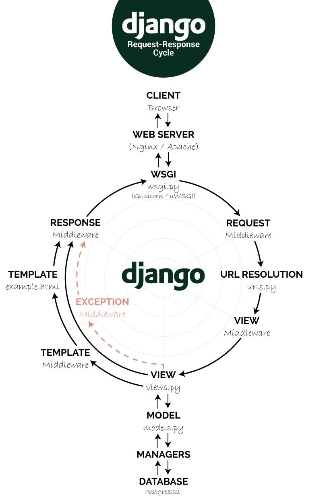

# Full-stack Interface

## Data Understanding - SQL

Client - Web Server - Application Servers - Databasem

"The goal of a model is to provide a simple low-dimensional summary of a dataset"

데이터 추상화


### MySQL & WorkBench 활용

#### 데이터베이스

구조화된 데이터의 모임. 여러 사람이 공유하고 사용할 목적으로 만들어진 정보의 집합으로, 테이블이라는 정보로 구조화되어 있음.

- 각 테이블은 특정 열의 조합으로 구성.

- 행(Observation): '가로축', row, 관측치, 개체(instance), 기록(record), 사례(example), 경우(case)
- 열(Feature): '세로축', 열(column), 특성, 속성(attribute), 변수(variable), field


#### 데이터베이스의 종류

**RDB**

- MySQL, MariaDB, Oracle 등.
- 관계형 데이터베이스는 행과 열로 구조화되어 있음. 구조화된 자료는 SQL을 통해 조회.

**NoSQL**

- MongoDB, Hbase, Casandara 등.
- 관계형 데이터베이스와 다르게 행, 열로 데이터가 구조화되지 않고 하나의 데이터를 하나의 문서로 표현. 즉, 행(Observation)이라는 개념보다 문서(Document)라는 개념으로 데이터를 바라봄.
- 분산 확장이 가능해 대용량 데이터 처리에 용이.


#### CRUD

create, read, update, delete


### SQL 문법

시작하기 전에 시스템 환경설정의 MySQL에서 서버가 실행중인지 확인.

자료 명령어 실행 후에는 항상 Response를 확인하여 자료의 정합성을 확인.

MySQL에서는 대소문자를 구분하지 않음(단, 따옴표'' 안의 문자열은 구분).

결과창에서 확인할 수 있는 cursor을 인지하고 있어야 함. 파이썬에서 연동할 때 사용.

종료시 강제종료하지 말고 File-Close Connection Tab을 이용해 종료할 것.


#### SELECT

- 칼럼 조회

  - `SELECT 호출하려는칼럼 또는 계산 FROM DB명.테이블명;`
  - `SELECT COUNT(상품 번호) FROM DB명.테이블명;`
  - `SELECT 칼럼1, 칼럼2 FROM DB명.테이블명;`

- 집계 함수

  - `SELECT 집계함수 FROM DB명.테이블명;`

    |   함수    |    의미     |
    | :-------: | :---------: |
    |  `AVG()`  |    평균     |
    | `COUNT()` | 개수 구하기 |
    |  `SUM()`  |    합계     |

    - 집계함수 COUNT() 내부에 CASE WHEN 구문을 사용하면 필요한 조건만 집계할 수 있음.

- *

  - 해당 테이블의 모든 칼럼을 조회.
  - `SELECT * FROM DB명.테이블명;`

- AS

  - 변수명 변경.
  - `SELECT 칼럼1 as 변경할칼럼명 FROM DB명.테이블명;`

- DISTINCT

  - 중복을 제외하고 데이터 조회.
  - `SELECT DISTINCT 칼럼 FROM DB명.테이블명;`


#### FROM

- `SELECT 호출하려는칼럼 또는 계산 FROM DB명.테이블명;`

- ```sql
  USE DB명;
  
  SELECT 호출하려는칼럼 또는 계산 
  FROM 테이블명;
  ```

  

#### WHERE

조건을 생성.

- `SELECT 칼럼 FROM DB명.테이블명 WHERE 칼럼 = '조건';`

- BETWEEN

  - 특정 칼럼의 값이 시작점~끝점인 데이터만 출력.

  - ``` sql
    SELECT *
    FROM DB명.테이블명
    WHERE 칼럼 BETWEEN 시작점 AND 끝점;
    ```

- 대소 관계 표현

  - ```sql
    SELECT *
    FROM DB명.테이블명
    WHERE 칼럼 '연산자' '조건';
    ```

    | 연산자 |   설명    |
    | :----: | :-------: |
    |   =    | 동일하다  |
    |   >    |   초과    |
    |   >=   |   이상    |
    |   <    |   미만    |
    |   <=   |   이하    |
    |   <>   | 같지 않다 |

- IN

  - 테이블에서 해당하는 칼럼값을 가진 데이터를 출력. ','는 '또는'을 의미.

  - ```sql
    SELECT 칼럼명
    FROM DB명.테이블명
    WHERE 칼럼명 IN (값1, 값2);
    ```

  - 숫자형은 그대로, 문자형은 ''를 사용하여 표현.

- NOT IN

  - 특정 값을 제외한 결과를 출력.

  - ```sql
    SELECT 칼럼명
    FROM DB명.테이블명
    WHERE 칼럼명 NOT IN (값1, 값2);
    ```

- IS NULL

  - 특정 값이 비어있는(NULL) 데이터를 출력.

  - NULL은 결측치(수집하지 못한 데이터)를 의미. 값이 0인 것과는 다름.

  - ```sql
    SELECT 칼럼명 또는 계산식
    FROM DB명.테이블명
    WHERE 칼럼명 IS NULL;
    ```

  - 특정 칼럼의 값이 NULL이 아닌 것만을 출력하고 싶다면 `IS NULL` 대신 `IS NOT NULL` 을 사용.

  - 주의) MySQL에서 데이터를 열람하면 각 테이블의 가장 마지막 행 다음에 모든 값이 `NULL` 인 행이 추가됨.

- LIKE '%TEXT%'

  - 특정 필드에 임의의 텍스트를 포함하는 경우를 출력.

  - ```sql
    SELECT *
    FROM DB명.테이블명
    WHERE 칼럼명 LIKE '%조건문자열%';
    ```

  - %는 문자를 의미하는데, 조건문자열 앞 뒤로 어떤 문자가 와도 상관없다는 뜻.


#### GROUP BY

- 칼럼의 값들을 그룹화해 각 값들의 평균 값, 개수 등을 구할 때 사용.

- 일반적으로 집계 함수와 함께 사용.

- ```sql
  SELECT 칼럼명, 집계함수
  FROM DB명.테이블명
  GROUP
  BY 조건칼럼;
  ```


#### JOIN

여러 테이블로 나뉜 정보를 조합할 때 테이블 결합 함수 JOIN을 사용.

- LEFT JOIN(LEFT OUTER JOIN)

  - 특정 테이블 정보를 기준으로 타 테이블을 결합.

  - TABLE_A는 기준 테이블, TABLE_B는 결합대상 테이블일 때,

    ```sql
    SELECT *
    FROM TABLE_A
    LEFT JOIN TABLE_B
    ON TABLE_A.Column1 = TABLE_B.Column2;
    ```

  - ON에는 데이터를 결합할 키 값을 입력(TABLE_A.Column1와 TABLE_B.Column2를 매칭).

- INNER JOIN

  - 두 테이블에 공통으로 존재하는 정보만 출력(교집합 개념).

  - ```sql
    SELECT *
    FROM TABLE_A
    INNER JOIN TABLE_B
    ON TABLE_A.Column1 = TABLE_B.Column2;
    ```

- FULL JOIN

  - 두 테이블에 매칭되는 정보를 모두 출력(합집합 개념).

  - FULL JOIN의 결과는 매우 큰 데이터 세트가 될 수 있음.

  - ```sql
    SELECT *
    FROM TABLE_A
    FULL JOIN TABLE_B
    ON TABLE_A.Column1 = TABLE_B.Column2;
    ```

  

#### CASE WHEN

- 조건에 따른 값을 다르게 출력하고 싶은 경우에 사용.

- ```sql
  SELECT CASE WHEN 조건1 THEN 결과1
  WHEN 조건2 THEN 결과2
  ELSE 결과3 END
  FROM DB명.테이블명;
  ```

  - 조건1을 만족하는 경우 결과1을 출력, 조건2를 만족하는 경우 결과2 출력, 조건1과 조건2를 모두 만족하지 않는 경우 결과3을 출력.
  - `ELSE` 를 사용하지 않았을 때, 각 조건을 모두 만족하지 못하는 경우는 `NULL` 을 출력.

- `GROUP BY` 다음의 칼럼명은 숫자로 대체 가능.

  - `GROUP BY 1` 은 SELECT의 첫 번째 칼럼으로 그룹핑하겠다는 의미.

  

#### RANK, DENSE_RANK, ROW_NUMBER

- 데이터에 순위를 매기는 데 사용하는 함수. 동점의 처리 방법에 차이.
- `SELECT RANK() OVER(ORDER BY column) FROM ...`
  - 동점을 같은 등수로 계산하되, 데이터 세트를 고려해 다음 등수를 매김.
- `SELECT DENSE_RANK() OVER(ORDER BY column) FROM ...`
  - 동점을 같은 등수로 계산하되, 다음 등수는 동점 등수의 바로 다음 등수를 매김.

- `SELECT ROW_NUMBER() OVER(ORDER BY column) FROM ...`
  - 동점인 경우도 서로 다른 등수로 계산.
- 특정 칼럼 내에서 순위를 매기려면 parition 사용.
  - `SELECT RANK/DENSE_RANK/ROW_NUMBER() OVER(PARTITION BY 분류칼럼 ORDER BY 순위기준칼럼) FROM ...`


#### SUBQUERY

- 연산자 이후 () 안의 쿼리를 의미.
- IN, FROM, JOIN 등에서 사용.
- subquery의 실행 결과가 하나의 테이블로 사용.
- FROM, JOIN에 subquery를 사용하는 경우, (subquery) 뒤에 항상 문자열을 입력해야 함. 쿼리 내부에서 사용하는 해당 테이블의 명칭.


### Import CSV

- Schemas - 우클릭 - Create Schema - 스키마 이름 입력 후 Apply로 생성.

- Table - 우클릭 - Table Data Import Wizard - Browse를 통해 csv 파일 선택 - Create new table - Encoding 설정, 소스 컬럼의 데이터 타입 확인 및 설정하여 생성.

생성 후에는 새로고침하여 이용.


### Google BigQuery


### Python - pymysql 연동

pip install mysql-connector-python

pip install PyMySQL==1.0.0


```python
import pymysql.cursors

# Connect to the database
connection = pymysql.connect(host='127.0.0.1',
        user='root',
        password='0000',
        db='TIP_Schema',
        charset='utf8',
        cursorclass=pymysql.cursors.DictCursor)
try:
    with connection.cursor() as cursor:
        # Read a single record
        #sql = "SELECT `id`, `password` FROM `users` WHERE `email`=%s"
        sql = "select total_bill from TIP_Schema.tips where tip >= 7;"
        cursor.execute(sql)
        result = cursor.fetchone()
        print(result)
finally:
    connection.close()
```

파이썬에서 sql을 실행시켜 커서가 위치한 부분의 값을 읽어오는 구문.


```python
import pymysql.cursors
import pandas as pd

# MySQL DB에서 데이터 받아와서 DataFrame에 저장
conn = pymysql.connect(host='127.0.0.1', user='root', 
                       password='0000', db='classicmodels',
                       charset='utf8', autocommit=True, 
                       cursorclass=pymysql.cursors.DictCursor)
try:
   with conn.cursor() as curs:
      sql = "select total_bill from TIP_Schema.tips where tip >= 7;"
      curs.execute(sql)
      rs = curs.fetchall()

      # DB에서 받아온 값을 DataFrame에 넣음
      df = pd.DataFrame(rs)
      print(df)
      # df.to_csv('query.csv')를 통해 받아온 데이터프레임을 csv로 저장할 수 있음.

finally:
   conn.close()
```

DataFrame의 형태로 표현.


### 시각화

pandas, matplotlib, seaborn을 활용하여 데이터 시각화.


### SQL vs NoSQL

최근에는 빅데이터에 적합한 NoSQL을 사용.


### 종합

지금까지 진행한 파편화된 기능들을 종합.

목표변수를 설정.

각 변수의 상관관계 확인. 각 변수와 목표변수 사이의 인과관계 확인.

공분산

여러 변수 사이의 관계를 확률분포로 표현.

tips 데이터를 이용.


#### 1. 사전 준비

- 결측치가 이미 제거된 자료이므로, 결측치 처리 연습을 위해 사전에 결측치를 생성해주기.

  - MySQL에서 null 값을 데이터에 삽입.

    ```sql
    use TIP_Schema;
    
    select * from tips; # 자료 확인.
    
    # 결측치를 포함한 임의의 값을 추가.
    insert into tips(total_bill, tip, sex, smoker, day, time, size)
    values(16.99, null, 'Female', 'No', 'Sun', 'Dinner', 2);
    
    insert into tips(total_bill, tip, sex, smoker, day, time, size)
    values(20.34, 1.66, null, 'No', 'Sun', 'Dinner', 3);
    
    insert into tips(total_bill, tip, sex, smoker, day, time, size)
    values(13.23, 2.66, 'Male', 'Yes', 'Sat', null, null);
    
    insert into tips(total_bill, tip, sex, smoker, day, time, size)
    values(26.34, 2.2, 'Female', 'No', 'Fri', 'Lunch', 4);
    
    # ...
    
    select * from tips; # 결과 확인.
    ```

  - (+ 값을 삭제할 때)

    ```sql
    # 삭제할 값 확인
    select * from tips where tips.sex is null;
    select * from tips where tips.tip is null;
    
    # 삭제
    delete from tips where tips.sex is null;
    delete from tips where tips.tip is null;
    
    # 결과 확인.
    select * from tips;
    ```

    

- 값이 수정된 데이터를 MySQL에서 추출.

  ```python
  import pymysql.cursors
  import pandas as pd
  import numpy as np
  
  conn = pymysql.connect(host='127.0.0.1', user='root', 
                         password='0000', db='TIP_Schema', charset='utf8',
                         autocommit=True, cursorclass=pymysql.cursors.DictCursor)
  
  try:
      with conn.cursor() as curs:
          sql = "select * from TIP_Schema.tips;"
          curs.execute(sql)
          rs = curs.fetchall()
          df = pd.DataFrame(rs)
          print(df)
          df.to_csv('tips2.csv')
          
  finally: 
      conn.close()
  ```


- pandas를 통해 데이터 읽어들이기.

  `tips = pd.read_csv('tips2.csv', index_col=0)`


#### 2. 문자형 변수를 숫자형 변수로 변환

- replace 메서드 사용.

  - `inplace = True` 사용.

    ```python
    tips['sex'].replace({'Female': 0, 'Male':1}, inplace=True)
    tips['smoker'].replace({'No': 0, 'Yes':1}, inplace=True)
    tips['day'].replace({'Thur': 0, 'Fri':1, 'Sat': 2, 'Sun': 3}, inplace=True)
    tips['time'].replace({'Lunch': 0, 'Dinner':1}, inplace=True)
    
    # 해당 변화를 데이터프레임에 즉각 반영.
    ```

  - 또는

    ```python
    tips['sex'] = tips['sex'].replace({'Female': 0, 'Male':1})
    tips['smoker'] = tips['smoker'].replace({'No': 0, 'Yes':1})
    tips['day'] = tips['day'].replace({'Thur': 0, 'Fri':1, 'Sat': 2, 'Sun': 3})
    tips['time'] = tips['time'].replace({'Lunch': 0, 'Dinner':1})
    
    # 해당 변화를 새로운 데이터프레임에 담음.
    ```


#### 3. 결측치 제거

- 임퓨터 가져오기.

  `from sklearn.impute import SimpleImputer`
  
- 결측치 확인.

  `tips.isnull().sum()`

- DataFrame 형태의 자료를 array로 변환.

  `data = tips.values`

- 결측치에 중위값을 입력하도록 설정.
  `imputer = SimpleImputer(strategy='median')`

- array의 결측치 제거.

  ```python
  imputer.fit(data)
  data_trans = imputer.transform(data)
  ```

- array를 다시 DataFrame 형식으로 변경

  `tips_trans = pd.DataFrame(data_trans, columns=['total_bill', 'tip', 'sex', 'smoker', 'day', 'time', 'size'])`

- 결측치가 제거되었는지 확인.

  `tips.isnull().sum()`


#### + 파생변수 추가

자료와 사업에 대한 통찰이 있다면, 적절한 파생변수를 추가할 수 있음.

```python
# 파생변수 1. tip rate
tip_rate = tips_imp.tip/tips_imp.total_bill
tips_imp['tip_rate'] = tip_rate

# 파생변수 2. 1인당 지불요금
tips_imp = tips_imp.assign(BPP=tips_imp["total_bill"] / tips_imp["size"])
```


#### 4. 특징 선별(RFE)

차원 축소를 위해 관련성이 높은 변수만 남기고 그 외의 변수는 배제.

- RFE와 PCA
  - RFE는 목표변수와 독립변수의 상관관계를 통해 차원을 축소. - 목표변수에 따라 결과가 다르게 나옴(Recursive Feature Elimination).
  - PCA는 목표변수 없이 독립변수의 상관관계만으로 차원을 축소(추출). - 목표변수와 관계없이 일정한 결과가 나옴(Principal component analysis).

- regression feature selection

  - 회귀분석을 통해 적절한 변수를 선별.

    

- 특징 추출을 위해 목표변수를 설정.

  - 1. 매출
    2. 팁
    3. 요일별 팀 size 수
    4. tip rate 
    5. 요일별 방문 예상 팀 수

  ```python
  # 목표변수 설정: tip(1)
  n = 1
  # 선택할 특징의 수 설정
  m = 5
  ```

  

- RFE를 이용한 특징 추출

  ```python
  # RFE
  from sklearn.feature_selection import RFE
  from sklearn.svm import SVR
  
  # 목표변수 입력
  y = tips_imp.iloc[:,n]
  X = tips_imp.drop(tips_imp.columns[[n]], axis=1)
  # 특징 추출
  estimator = SVR(kernel="linear")
  rfe = RFE(estimator, n_features_to_select=m)
  rfe.fit(X, y)
  for i in range(X.shape[1]):
      print('Column: %d, Rank: %d, Selected=%s' % (i, rfe.ranking_[i], rfe.support_[i]))
  ```
  
  선별된 특징 확인.
  
  ```python
  tips_RFE = tips_imp.copy()
  for i in range(X.shape[1]):
      if rfe.support_[i] == False:
          if i < n:
              k = i
          else:
              k = i+1
          tips_RFE.drop(tips_imp.columns[[k]], axis=1,
                        inplace=True)
  tips_RFE
  ```
  
  컬럼 선별.


#### 5. 데이터 정규화 및 표준화

- 정규화

  ```python
  # 정규화
  from sklearn.preprocessing import MinMaxScaler
  
  
  trans = MinMaxScaler()
  tips_N = trans.fit_transform(tips_RFE)
  tips_RFE_norm = pd.DataFrame(tips_N, columns=[tips_RFE.columns])
  tips_RFE_norm.describe()
  ```

  

- 표준화

  ```python
  # 표준화
  from sklearn.preprocessing import StandardSca
  
  
  sc = StandardScaler()
  tips_S = sc.fit_transform(tips_RFE)
  tips_RFE_stan = pd.DataFrame(tips_S, columns=[tips_RFE.columns])
  tips_RFE_stan.describe().round()
  ```
  
  

#### + 다른 방법을 사용하여 특징 추출

- PCA

  - pca의 경우 차원축소 진행 전에 꼭 정규화/표준화를 해야 한다.

  ```python
  # PCA
  from sklearn.decomposition import PCA
  
  trans = PCA(n_components=m)
  tips_PCA = trans.fit_transform(tips_imp)
  tips_PCA[:3,:]
  ```

  

- Regression Feature Selection

  ```python
  # regression feature selection
  from sklearn.feature_selection import SelectKBest
  from sklearn.feature_selection import f_regression
  
  # 목표변수 입력
  y = tips_imp.iloc[:,n]
  X = tips_imp.drop(tips_imp.columns[[n]], axis=1)
  # 특징 추출
  fs = SelectKBest(score_func=f_regression, k=m)
  tips_RFS = fs.fit_transform(X, y)
  fs.get_support(indices=True)
  ```
  
  선별된 특징 확인.
  
  ```python
  selectC = fs.get_support(indices=True)
  tips_RFS = tips_imp.copy()
  for i in range(X.shape[1]):
      if i not in selectC:
          if i < n:
              k = i
          else:
              k = i+1
          tips_RFS.drop(tips_imp.columns[[k]], axis=1,
                        inplace=True)
  tips_RFS
  ```
  
  칼럼 선별.


## Web

- HTML/CSS

- JavaScript/Jquery

- BootSrap

- Django(MVC/CRUD)


### HTML

define the content of web pages

```html
<!DOCTYPE html>
<html>
<head>
<title>Page Title</title>
</head>
<body>

<h1>This is a Heading</h1>
<p>This is a paragraph.</p>

</body>
</html>
```

- `<!DOCTYPE html>`: 문서 타입이 html임을 확인. 없어도 작동함.
- `<tagname> Content goes here... </tagname>`: `<>` 를 사용해 태그를 설정, 태그의 끝은 `/` 를 사용해 지정. 시작과 끝을 모두 표시해야 함.
- `<html>`: the root element of an HTML page
- `<head>`: contains meta information about the HTML page
- `<title>`: specifies a title for the HTML page (which is shown in the browser's title bar or in the page's tab)
- `<body>`: defines the document's body, and is a container for all the visible contents, such as headings, paragraphs, images, hyperlinks, tables, lists, etc.
- `<h1>`: defines a large heading
- `<p>`: defines a paragraph


### CSS

Cascading Style Sheets: specify the layout of web pages

- Inline

  ```html
  <h1 style="color:blue;">A Blue Heading</h1>
  
  <p style="color:red;">A red paragraph.</p>
  ```

  - `style` 을 이용해 하나의 html 라인 안에서 이용.

- Internal

  ```html
  <!DOCTYPE html>
  <html>
  <head>
  <style>
  body {background-color: powderblue;}
  h1   {color: blue;}
  p    {color: red;}
  </style>
  </head>
  <body>
  
  <h1>This is a heading</h1>
  <p>This is a paragraph.</p>
  
  </body>
  </html>
  ```

  - `<head>` 섹션에 `<style>` 을 정의하여 사용.

- External

  ```html
  <!DOCTYPE html>
  <html>
  <head>
    <link rel="stylesheet" href="styles.css">
  </head>
  <body>
  
  <h1>This is a heading</h1>
  <p>This is a paragraph.</p>
  
  </body>
  </html>
  ```

  - `link` 사용하여 외부 css 파일을 불러와 이용.

  - 'styles.css'

    ```css
    body {
      background-color: powderblue;
    }
    h1 {
      color: blue;
    }
    p {
      color: red;
    }
    ```

    

### JavaScript

program the behavior of web pages

```html
<p id="demo"></p>

<script>
var x, y, z;  // Declare 3 variables
x = 5;    // Assign the value 5 to x
y = 6;    // Assign the value 6 to y
z = x + y;  // Assign the sum of x and y to z

document.getElementById("demo").innerHTML =
"The value of z is " + z + ".";
</script>
```

- `<script>` 를 정의하여 내부에 javascript 코드를 입력하여 활용.


---

### Django

**Conda env for Django**

conda deactivate

conda create --name django python=3.8.3

conda env list

conda activate django

pip install ipykernel

python -m ipykernel install --user --name django --display-name "Python Django"

conda install -c conda-forge jupyterlab


**Django Installation**

pip install Django==3.2.4


**장고 실행**



프로젝트 생성

`django-admin startproject mysite`

서버 구동

`python manage.py runserver`


## Web_Crawling


python camelot: pdf 파일에서 표를 추출.